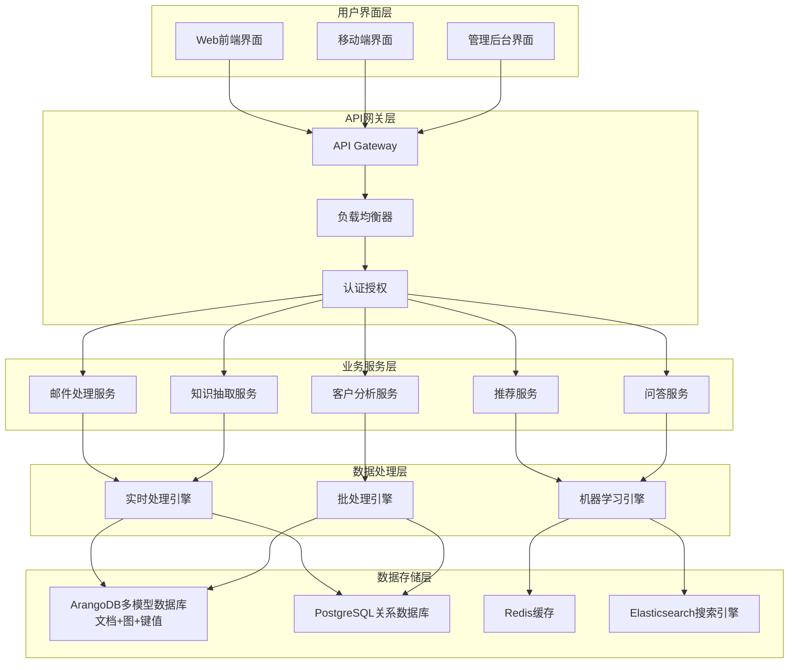
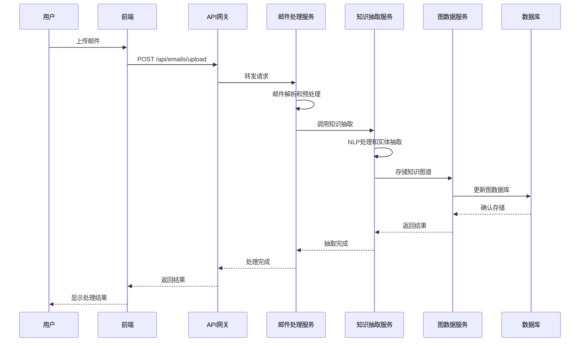
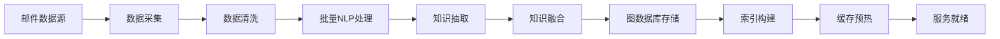
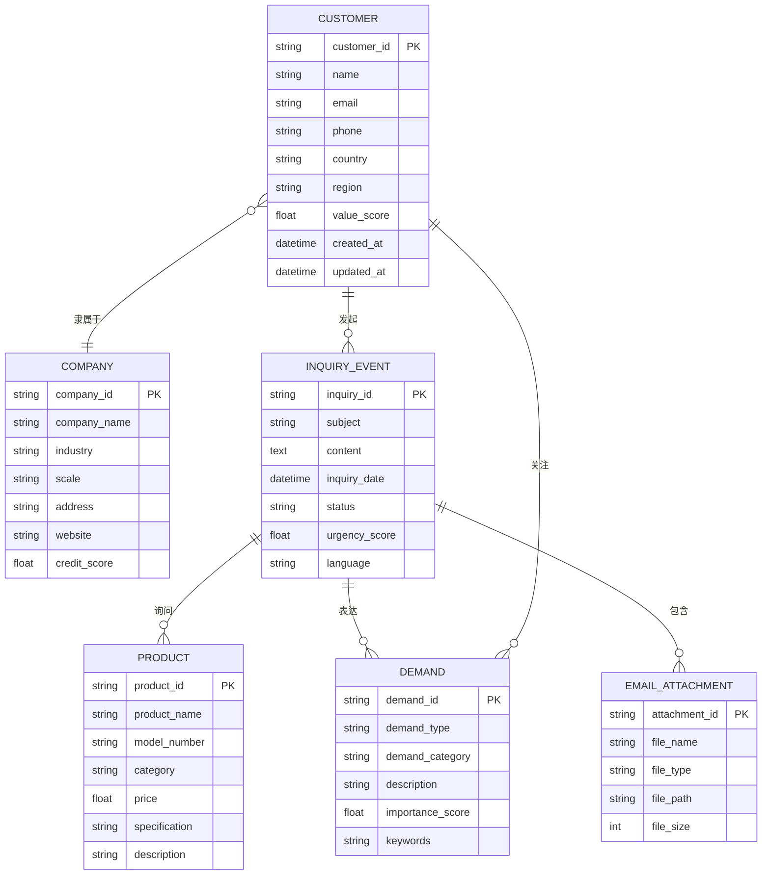
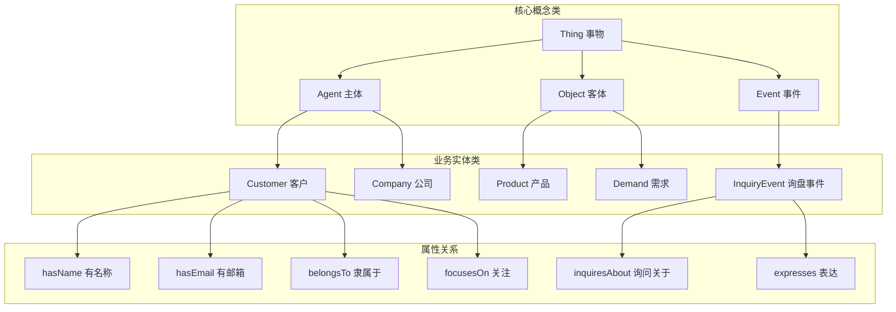
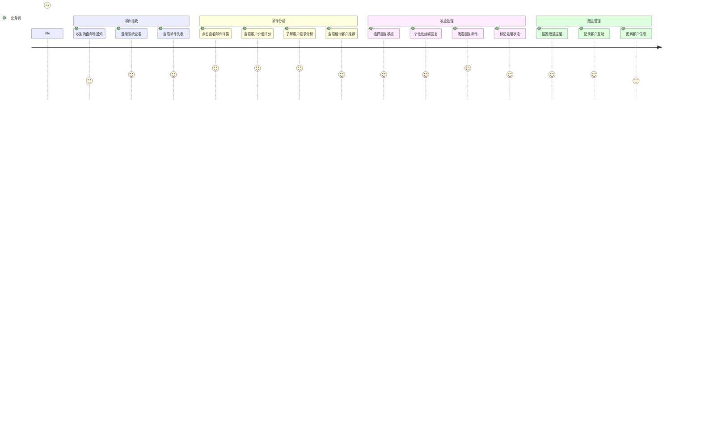
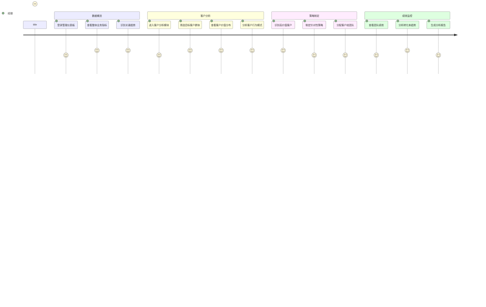
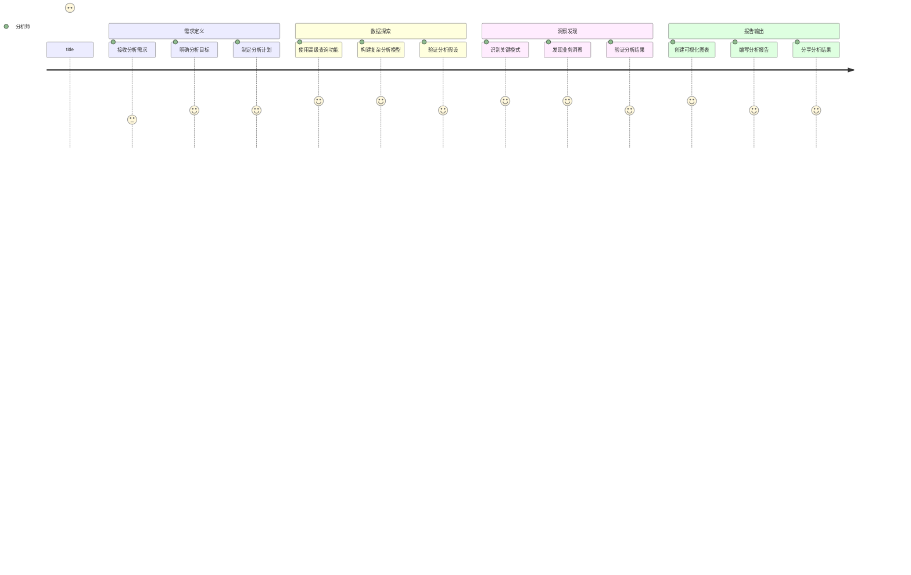

# 外贸询盘知识图谱系统需求设计文档

## 1. 项目概述

### 1.1 项目背景
本项目旨在利用知识图谱技术分析外贸询盘邮件，通过将非结构化的邮件文本转化为结构化知识，实现价值客户识别和关键需求洞察，为外贸业务决策提供数据支持。

### 1.2 核心目标
- **价值客户识别**：通过分析客户询盘行为、公司背景、产品偏好等维度，识别高价值潜在客户
- **需求洞察分析**：挖掘客户对产品的关键需求，为产品改进和营销策略提供依据
- **智能决策支持**：构建智能问答和推荐系统，提升客户服务效率和质量

### 1.3 应用场景
- 处理近1000封外贸询盘邮件的结构化分析
- 客户价值评估和分级管理
- 产品需求趋势分析和市场洞察
- 个性化客户服务和产品推荐

## 2. 核心功能需求

### 2.1 外贸询盘本体管理

#### 2.1.1 本体设计要求
**核心概念类别：**
- **客户 (Customer)**
  - 潜在客户 (Potential Customer)
  - 现有客户 (Existing Customer) 
  - 高价值客户 (High-Value Customer)
- **公司 (Company)**
  - 公司实体信息管理
- **产品 (Product)**
  - 产品类别 (Product Category)
  - 具体型号 (Specific Model)
- **需求/关注点 (Demand/Concern)**
  - 产品需求 (Product Demand)
    - 性能需求 (Performance)
    - 外观设计 (Appearance)
    - 材料需求 (Material)
    - 智能化需求 (Smart Features)
  - 商务需求 (Business Demand)
    - 价格关注 (Price)
    - 最小起订量 (MOQ)
    - 交付周期 (Lead Time)
    - 认证要求 (Certification)
- **询盘事件 (Inquiry Event)**
  - 每封询盘邮件的事件记录

#### 2.1.2 属性和关系定义
**数据属性：**
- 客户：姓名、邮箱、国家/地区、客户价值评分
- 公司：公司名、行业、规模
- 产品：型号、价格、规格
- 询盘事件：询盘日期、邮件主题、内容摘要

**对象关系：**
- 来自 (comes_from)：询盘事件 → 客户
- 隶属于 (belongs_to)：客户 → 公司
- 询问 (inquires_about)：询盘事件 → 产品
- 表达 (expresses)：询盘事件 → 需求/关注点
- 关注 (focuses_on)：客户 → 需求/关注点

#### 2.1.3 推理规则
- 客户价值自动分级：基于询盘频率、产品价值、公司规模等因素
- 需求关联发现：识别共现的需求模式
- 客户行为预测：基于历史数据预测客户后续行为

### 2.2 邮件知识抽取系统

#### 2.2.1 实体识别 (NER)
**目标实体类型：**
- 客户信息：姓名、邮箱、电话
- 公司信息：公司名、地址、行业
- 产品信息：产品名、型号、规格
- 商务信息：价格、数量、交期、认证要求
- 地理信息：国家、城市、地区

#### 2.2.2 关系抽取 (RE)
**关系类型：**
- 客户-产品关系：询问、感兴趣、购买意向
- 客户-需求关系：关注、要求、偏好
- 产品-特性关系：具有、支持、符合
- 时间关系：询盘时间、交期要求

#### 2.2.3 LLM Agent 抽取框架
**多Agent协作架构：**
- **客户信息抽取Agent**：专门识别和提取客户相关信息
- **产品需求分析Agent**：解析产品规格和技术要求
- **商务条件抽取Agent**：提取价格、交期、支付等商务信息
- **情感分析Agent**：分析客户询盘的紧急程度和购买意向

### 2.3 客户价值分析系统

#### 2.3.1 客户价值评估模型
**评估维度：**
- **询盘活跃度**：询盘频率、时间间隔、持续性
- **产品价值度**：询盘产品的价格区间、利润空间
- **公司实力度**：公司规模、行业地位、信用状况
- **需求明确度**：需求描述的详细程度、专业性
- **合作潜力度**：历史成交记录、合作意向强度

#### 2.3.2 客户分级管理
- **A级客户**：高价值、高潜力、优先跟进
- **B级客户**：中等价值、有潜力、定期维护
- **C级客户**：低价值、观察跟踪

#### 2.3.3 客户画像构建
- 基础信息画像：地理分布、行业分布、公司规模
- 行为画像：询盘习惯、产品偏好、沟通特点
- 需求画像：关注重点、价格敏感度、质量要求

### 2.4 需求洞察分析系统

#### 2.4.1 需求趋势分析
- **热门需求识别**：统计高频需求关键词和主题
- **需求变化趋势**：分析需求随时间的变化模式
- **地域需求差异**：不同地区客户的需求特点对比
- **行业需求特征**：不同行业客户的共性需求

**详细流程步骤：**

**步骤1：数据收集和预处理**
- 从ArangoDB中提取所有询盘事件和需求数据
- 清洗和标准化需求描述文本，去除噪声数据
- 按时间、地域、行业维度对数据进行分类整理
- 建立需求词汇表和同义词映射关系

**步骤2：关键词提取和主题建模**
- 使用TF-IDF算法提取需求关键词，识别高频词汇
- 应用LDA主题建模发现潜在需求主题
- 通过词云可视化展示热门需求关键词
- 建立需求分类体系和标签系统

**步骤3：时间序列分析**
- 构建需求频次的时间序列数据
- 使用移动平均和季节性分解识别趋势模式
- 应用ARIMA模型预测未来需求趋势
- 检测需求突变点和异常波动

**步骤4：地域和行业对比分析**
- 按国家/地区统计需求分布，生成地理热力图
- 计算不同地区需求相似度和差异指数
- 分析各行业客户的需求偏好特征
- 识别地域性和行业性需求模式

**步骤5：结果可视化和报告生成**
- 生成需求趋势图表和仪表板
- 创建交互式需求分析报告
- 输出需求洞察摘要和关键发现
- 提供趋势预测和业务建议

**预期输出结果：**
- 需求热度排行榜和趋势图
- 地域需求分布地图
- 行业需求特征报告
- 需求预测和商机识别报告

#### 2.4.2 产品优化建议
- 基于需求频率的产品改进方向
- 新产品开发机会识别
- 产品定位和营销策略建议

**详细流程步骤：**

**步骤1：需求频率统计分析**
- 统计各产品类别的询盘频次和需求强度
- 分析需求与现有产品功能的匹配度
- 识别高频但未满足的需求缺口
- 计算需求满足率和产品竞争力指数

**步骤2：产品改进方向识别**
- 基于客户反馈和需求分析识别产品痛点
- 使用关联规则挖掘需求与产品特性的关系
- 优先级排序产品改进需求（紧急度×影响度）
- 评估改进成本和预期收益

**步骤3：新产品开发机会评估**
- 识别市场空白和未覆盖的需求领域
- 分析竞争对手产品布局和差异化机会
- 评估新产品开发的技术可行性
- 计算市场潜力和投资回报率

**步骤4：营销策略制定流程**
- 基于客户画像制定目标市场策略
- 分析不同客户群体的价格敏感度
- 设计差异化的产品定位和价值主张
- 制定渠道策略和推广计划

**步骤5：建议输出和验证**
- 生成产品优化建议报告
- 通过A/B测试验证策略效果
- 建立反馈循环机制持续优化
- 跟踪实施效果和ROI指标

**预期输出结果：**
- 产品改进优先级清单
- 新产品开发机会报告
- 差异化营销策略方案
- 产品路线图和实施计划

#### 2.4.3 需求关联分析
- 需求共现模式发现
- 需求依赖关系分析
- 客户需求演进路径

**详细流程步骤：**

**步骤1：需求共现模式挖掘算法**
- 构建需求共现矩阵，统计需求组合频次
- 应用Apriori算法挖掘频繁需求项集
- 使用FP-Growth算法提高挖掘效率
- 计算需求间的支持度、置信度和提升度

**步骤2：依赖关系分析方法**
- 建立需求依赖图，识别前置和后置需求
- 使用条件概率分析需求间的因果关系
- 应用图算法发现需求传播路径
- 识别核心需求节点和影响力传播模式

**步骤3：客户需求演进路径追踪**
- 按时间序列追踪单个客户的需求变化
- 识别典型的需求演进模式和阶段
- 构建需求生命周期模型
- 预测客户下一阶段可能的需求

**步骤4：关联规则生成和验证**
- 生成"如果-那么"形式的需求关联规则
- 设置最小支持度和置信度阈值过滤规则
- 通过历史数据验证规则的准确性
- 建立规则质量评估和更新机制

**步骤5：洞察结果应用指导**
- 将关联规则应用于产品推荐系统
- 指导销售团队进行交叉销售
- 优化产品组合和套餐设计
- 制定个性化的客户服务策略

**预期输出结果：**
- 需求关联规则库
- 需求依赖关系图谱
- 客户需求演进模式报告
- 交叉销售机会识别清单

### 2.5 智能问答和推荐系统

#### 2.5.1 智能问答功能
**支持的查询类型：**
- "哪些客户对XX产品最感兴趣？"
- "来自欧洲的客户主要关注哪些产品特性？"
- "高价值客户通常有哪些共同需求？"
- "最近3个月询盘频率最高的产品是什么？"

#### 2.5.2 智能推荐功能
- **客户推荐**：为特定产品推荐潜在客户
- **产品推荐**：为客户推荐相关产品
- **营销策略推荐**：基于客户画像推荐营销方案

#### 2.5.3 自动化客户服务
- 邮件自动分类和优先级排序
- 客户询盘自动回复建议
- 跟进提醒和任务分配

## 3. 系统架构设计

### 3.1 整体系统架构

#### 3.1.1 分层架构设计


#### 3.1.2 ArangoDB多模型优势

**为什么选择ArangoDB：**

1. **多模型统一存储**
   - **文档存储**：客户信息、邮件内容、产品详情等结构化和半结构化数据
   - **图数据库**：客户-公司-产品-需求之间的复杂关系网络
   - **键值存储**：缓存客户评分、会话状态等快速访问数据

2. **外贸询盘场景适配**
   - **客户档案**：以文档形式存储完整的客户信息，包括联系方式、公司背景、历史记录
   - **关系网络**：以图形式建模客户-公司-产品-需求的复杂关系
   - **实时查询**：支持复杂的图遍历查询，如"找出对某产品感兴趣的所有高价值客户"
   - **灵活扩展**：随着业务发展，可以轻松添加新的数据类型和关系

3. **技术优势**
   - **单一查询语言AQL**：统一处理文档查询、图遍历、聚合分析
   - **ACID事务支持**：确保数据一致性，支持跨集合事务
   - **水平扩展**：支持分片和集群部署，满足大规模数据需求
   - **丰富的索引**：支持全文搜索、地理空间、图索引等多种索引类型

#### 3.1.3 微服务架构设计

**核心微服务组件：**

1. **用户管理服务 (User Service)**
   - 用户注册、登录、权限管理
   - 用户画像和偏好设置
   - 多租户支持

2. **邮件处理服务 (Email Processing Service)**
   - 邮件导入和解析
   - 邮件分类和预处理
   - 邮件内容清洗和标准化

3. **知识抽取服务 (Knowledge Extraction Service)**
   - NLP实体识别和关系抽取
   - LLM Agent协作处理
   - 知识质量评估和验证

4. **图数据管理服务 (Graph Data Service)**
   - 知识图谱构建和维护
   - 图数据查询和更新
   - 本体管理和推理

5. **客户分析服务 (Customer Analytics Service)**
   - 客户价值评估
   - 客户画像构建
   - 客户行为分析

6. **推荐服务 (Recommendation Service)**
   - 客户推荐算法
   - 产品推荐引擎
   - 营销策略推荐

7. **智能问答服务 (QA Service)**
   - 自然语言查询处理
   - 图数据库查询转换
   - 结果格式化和展示

### 3.2 技术架构详细设计

#### 3.2.0 ArangoDB Python集成方案

**Python-Arango库集成：**

```python
# ArangoDB连接和操作示例
from arango import ArangoClient
from typing import Dict, List, Any
import json

class ArangoDBService:
    """
    ArangoDB数据库服务类
    提供外贸询盘知识图谱的数据存储和查询功能
    """
    
    def __init__(self, host: str = 'localhost', port: int = 8529, 
                 database: str = 'emailagent', username: str = 'root', password: str = None):
        """
        初始化ArangoDB连接
        
        Args:
            host: ArangoDB服务器地址
            port: 端口号
            database: 数据库名称
            username: 用户名
            password: 密码
        """
        self.client = ArangoClient(hosts=f'http://{host}:{port}')
        self.db = self.client.db(database, username=username, password=password)
    
    def create_customer(self, customer_data: Dict[str, Any]) -> Dict[str, Any]:
        """
        创建客户文档
        
        Args:
            customer_data: 客户数据字典
            
        Returns:
            创建结果
        """
        customers = self.db.collection('customers')
        return customers.insert(customer_data)
    
    def create_relationship(self, from_collection: str, from_key: str, 
                          to_collection: str, to_key: str, 
                          edge_collection: str, edge_data: Dict[str, Any] = None) -> Dict[str, Any]:
        """
        创建实体间关系
        
        Args:
            from_collection: 源集合名
            from_key: 源文档键
            to_collection: 目标集合名
            to_key: 目标文档键
            edge_collection: 边集合名
            edge_data: 边数据
            
        Returns:
            创建结果
        """
        edges = self.db.collection(edge_collection)
        edge_doc = {
            '_from': f'{from_collection}/{from_key}',
            '_to': f'{to_collection}/{to_key}',
            **(edge_data or {})
        }
        return edges.insert(edge_doc)
    
    def query_high_value_customers(self, min_score: float = 80.0) -> List[Dict[str, Any]]:
        """
        查询高价值客户及其关联信息
        
        Args:
            min_score: 最低价值评分
            
        Returns:
            高价值客户列表
        """
        aql = """
        FOR customer IN customers
            FILTER customer.value_score >= @min_score
            FOR company IN 1..1 OUTBOUND customer belongs_to
            LET inquiries = (
                FOR inquiry IN 1..1 INBOUND customer GRAPH 'inquiry_graph'
                RETURN inquiry
            )
            RETURN {
                customer: customer,
                company: company,
                inquiry_count: LENGTH(inquiries),
                recent_inquiries: inquiries[0..2]
            }
        """
        return list(self.db.aql.execute(aql, bind_vars={'min_score': min_score}))
    
    def analyze_customer_product_preferences(self, customer_id: str) -> Dict[str, Any]:
        """
        分析客户产品偏好
        
        Args:
            customer_id: 客户ID
            
        Returns:
            客户产品偏好分析结果
        """
        aql = """
        FOR customer IN customers
            FILTER customer.customer_id == @customer_id
            FOR inquiry IN 1..1 INBOUND customer GRAPH 'inquiry_graph'
                FOR product IN 1..1 OUTBOUND inquiry inquires_about
                COLLECT category = product.category WITH COUNT INTO count
                SORT count DESC
                RETURN {
                    category: category,
                    inquiry_count: count
                }
        """
        return list(self.db.aql.execute(aql, bind_vars={'customer_id': customer_id}))

# Flask应用集成示例
from flask import Flask, request, jsonify

app = Flask(__name__)
arango_service = ArangoDBService()

@app.route('/api/v1/customers/high-value', methods=['GET'])
def get_high_value_customers():
    """
    获取高价值客户列表API
    """
    min_score = request.args.get('min_score', 80.0, type=float)
    try:
        customers = arango_service.query_high_value_customers(min_score)
        return jsonify({
            'success': True,
            'data': customers,
            'count': len(customers)
        })
    except Exception as e:
        return jsonify({
            'success': False,
            'error': str(e)
        }), 500

@app.route('/api/v1/customers/<customer_id>/preferences', methods=['GET'])
def get_customer_preferences(customer_id: str):
    """
    获取客户产品偏好API
    """
    try:
        preferences = arango_service.analyze_customer_product_preferences(customer_id)
        return jsonify({
            'success': True,
            'data': preferences
        })
    except Exception as e:
        return jsonify({
            'success': False,
            'error': str(e)
        }), 500
```

#### 3.2.1 前端技术栈
```
┌─────────────────────────────────────┐
│           前端架构                    │
├─────────────────────────────────────┤
│ UI框架: React 18 + TypeScript       │
│ 状态管理: Redux Toolkit + RTK Query │
│ 路由管理: React Router v6           │
│ UI组件库: Ant Design + Custom       │
│ 图表可视化: D3.js + ECharts         │
│ 图谱可视化: Cytoscape.js + Vis.js   │
│ 构建工具: Vite + ESBuild            │
│ 代码质量: ESLint + Prettier         │
└─────────────────────────────────────┘
```

#### 3.2.2 后端技术栈
```
┌─────────────────────────────────────┐
│           后端架构                    │
├─────────────────────────────────────┤
│ Web框架: Flask + Flask-RESTful      │
│ API文档: Flask-RESTX + Swagger      │
│ 认证授权: JWT + Flask-JWT-Extended  │
│ 数据验证: Marshmallow + Cerberus    │
│ 任务队列: Celery + Redis            │
│ 缓存系统: Redis + Flask-Caching     │
│ 日志系统: Python Logging + ELK      │
│ 监控告警: Prometheus + Grafana      │
└─────────────────────────────────────┘
```

#### 3.2.3 数据存储技术栈
```
┌─────────────────────────────────────┐
│          数据存储架构                 │
├─────────────────────────────────────┤
│ 多模型数据库: ArangoDB 3.10+        │
│ 关系数据库: PostgreSQL 14+          │
│ 缓存数据库: Redis 6+                │
│ 搜索引擎: Elasticsearch 8+          │
│ 文件存储: MinIO / AWS S3            │
│ 数据备份: arangodump + pg_dump      │
│ 数据同步: Apache Kafka              │
└─────────────────────────────────────┘
```

#### 3.2.4 AI/ML技术栈
```
┌─────────────────────────────────────┐
│          AI/ML技术架构               │
├─────────────────────────────────────┤
│ NLP框架: spaCy + NLTK + Transformers│
│ 深度学习: PyTorch + Hugging Face    │
│ 机器学习: Scikit-learn + XGBoost    │
│ 大语言模型: OpenAI API / 本地LLM     │
│ 向量数据库: Pinecone / Weaviate     │
│ 模型服务: MLflow + TensorFlow Serving│
│ 特征工程: Pandas + NumPy            │
└─────────────────────────────────────┘
```

### 3.3 部署架构设计

#### 3.3.1 容器化部署
```yaml
# Docker Compose 架构示例
version: '3.8'
services:
  # 前端服务
  frontend:
    image: emailagent/frontend:latest
    ports:
      - "3000:3000"
    
  # API网关
  api-gateway:
    image: nginx:alpine
    ports:
      - "80:80"
      - "443:443"
    
  # 后端服务集群
  backend:
    image: emailagent/backend:latest
    deploy:
      replicas: 3
    ports:
      - "5000-5002:5000"
    environment:
      - ARANGODB_URL=http://arangodb:8529
      - ARANGODB_DATABASE=emailagent
      - ARANGODB_USERNAME=root
      - ARANGODB_PASSWORD=${ARANGODB_PASSWORD}
    
  # 数据库服务
  arangodb:
    image: arangodb:3.10
    ports:
      - "8529:8529"
    environment:
      - ARANGO_ROOT_PASSWORD=${ARANGODB_PASSWORD}
    volumes:
      - arangodb_data:/var/lib/arangodb3
      - arangodb_apps:/var/lib/arangodb3-apps
    
  postgresql:
    image: postgres:14
    ports:
      - "5432:5432"
    environment:
      - POSTGRES_DB=emailagent
      - POSTGRES_USER=postgres
      - POSTGRES_PASSWORD=${POSTGRES_PASSWORD}
    
  redis:
    image: redis:6-alpine
    ports:
      - "6379:6379"

volumes:
  arangodb_data:
  arangodb_apps:
```

#### 3.3.2 云原生部署（Kubernetes）
```yaml
# Kubernetes 部署示例
apiVersion: apps/v1
kind: Deployment
metadata:
  name: emailagent-backend
spec:
  replicas: 3
  selector:
    matchLabels:
      app: emailagent-backend
  template:
    metadata:
      labels:
        app: emailagent-backend
    spec:
      containers:
      - name: backend
        image: emailagent/backend:latest
        ports:
        - containerPort: 5000
        env:
        - name: DATABASE_URL
          valueFrom:
            secretKeyRef:
              name: db-secret
              key: url
```

#### 3.3.3 Windows单机部署方案

**适用场景：**
- 开发环境和测试环境
- 小规模生产环境
- 概念验证和原型开发
- 单机资源充足的部署需求

##### 3.3.3.1 推荐数据库组合

**核心方案：ArangoDB + PostgreSQL**

```
┌─────────────────────────────────────────────────────────────┐
│                    Windows 10/11 环境                       │
├─────────────────────────────────────────────────────────────┤
│  应用层                                                     │
│  ┌─────────────────┐  ┌─────────────────┐                 │
│  │ React 前端      │  │ Flask 后端      │                 │
│  │ Port: 3000     │  │ Port: 5000     │                 │
│  └─────────────────┘  └─────────────────┘                 │
├─────────────────────────────────────────────────────────────┤
│  数据层                                                     │
│  ┌─────────────────┐  ┌─────────────────┐  ┌─────────────┐ │
│  │ ArangoDB       │  │ PostgreSQL     │  │ Redis       │ │
│  │ 图+文档+键值    │  │ 关系型数据      │  │ 缓存        │ │
│  │ Port: 8529     │  │ Port: 5432     │  │ Port: 6379  │ │
│  └─────────────────┘  └─────────────────┘  └─────────────┘ │
├─────────────────────────────────────────────────────────────┤
│  管理工具                                                   │
│  ┌─────────────────┐  ┌─────────────────┐                 │
│  │ ArangoDB Web UI│  │ pgAdmin        │                 │
│  │ Port: 8529     │  │ Port: 5050     │                 │
│  └─────────────────┘  └─────────────────┘                 │
└─────────────────────────────────────────────────────────────┘
```

**数据库选择理由：**

1. **ArangoDB（主要数据存储）**
   - ✅ 多模型支持：文档、图、键值三合一
   - ✅ 完美适配外贸询盘场景的复杂关系
   - ✅ 统一AQL查询语言，降低学习成本
   - ✅ Windows原生支持，安装简单
   - ✅ Web管理界面，开发友好

2. **PostgreSQL（辅助数据存储）**
   - ✅ 成熟稳定的关系型数据库
   - ✅ 处理结构化数据和复杂查询
   - ✅ 优秀的Windows支持和生态
   - ✅ pgAdmin图形化管理工具

3. **Redis（缓存层）**
   - ✅ 高性能内存缓存
   - ✅ 会话管理和临时数据存储
   - ✅ 支持多种数据结构

##### 3.3.3.2 Windows环境安装方式

**方式一：Docker Desktop部署（推荐）**

**步骤1：安装Docker Desktop**
```bash
# 1. 下载Docker Desktop for Windows
# https://www.docker.com/products/docker-desktop/

# 2. 安装后启用WSL2后端（推荐）
# 设置 -> General -> Use WSL 2 based engine

# 3. 验证安装
docker --version
docker-compose --version
```

**步骤2：创建Docker Compose配置**

创建 `docker-compose.yml` 文件：

```yaml
version: '3.8'

services:
  # ArangoDB多模型数据库
  arangodb:
    image: arangodb:3.10
    container_name: emailagent-arangodb
    ports:
      - "8529:8529"
    environment:
      - ARANGO_ROOT_PASSWORD=emailagent123
      - ARANGO_STORAGE_ENGINE=rocksdb
    volumes:
      - arangodb_data:/var/lib/arangodb3
      - arangodb_apps:/var/lib/arangodb3-apps
    restart: unless-stopped
    networks:
      - emailagent-network

  # PostgreSQL关系数据库
  postgres:
    image: postgres:14
    container_name: emailagent-postgres
    ports:
      - "5432:5432"
    environment:
      - POSTGRES_DB=emailagent
      - POSTGRES_USER=postgres
      - POSTGRES_PASSWORD=emailagent123
      - POSTGRES_INITDB_ARGS=--encoding=UTF-8 --lc-collate=C --lc-ctype=C
    volumes:
      - postgres_data:/var/lib/postgresql/data
      - ./init-scripts:/docker-entrypoint-initdb.d
    restart: unless-stopped
    networks:
      - emailagent-network

  # Redis缓存数据库
  redis:
    image: redis:6-alpine
    container_name: emailagent-redis
    ports:
      - "6379:6379"
    command: redis-server --appendonly yes --requirepass emailagent123
    volumes:
      - redis_data:/data
    restart: unless-stopped
    networks:
      - emailagent-network

  # pgAdmin管理工具
  pgadmin:
    image: dpage/pgadmin4:latest
    container_name: emailagent-pgadmin
    ports:
      - "5050:80"
    environment:
      - PGADMIN_DEFAULT_EMAIL=admin@emailagent.com
      - PGADMIN_DEFAULT_PASSWORD=admin123
      - PGADMIN_CONFIG_SERVER_MODE=False
    volumes:
      - pgadmin_data:/var/lib/pgadmin
    restart: unless-stopped
    networks:
      - emailagent-network
    depends_on:
      - postgres

# 数据卷定义
volumes:
  arangodb_data:
    driver: local
  arangodb_apps:
    driver: local
  postgres_data:
    driver: local
  redis_data:
    driver: local
  pgadmin_data:
    driver: local

# 网络定义
networks:
  emailagent-network:
    driver: bridge
```

**步骤3：一键部署命令**
```bash
# 启动所有服务
docker-compose up -d

# 查看服务状态
docker-compose ps

# 查看服务日志
docker-compose logs -f arangodb
docker-compose logs -f postgres

# 停止所有服务
docker-compose down

# 停止并删除数据卷（谨慎使用）
docker-compose down -v
```

**方式二：Windows原生安装**

**ArangoDB原生安装：**
```bash
# 1. 下载Windows安装包
# https://www.arangodb.com/download/
# 选择Windows MSI安装包

# 2. 运行安装程序
# - 选择安装路径（建议：C:\Program Files\ArangoDB3）
# - 设置root用户密码
# - 选择存储引擎（推荐RocksDB）
# - 配置服务端口（默认8529）

# 3. 启动服务
net start ArangoDB

# 4. 访问Web界面
# http://localhost:8529
```

**PostgreSQL原生安装：**
```bash
# 1. 下载Windows安装程序
# https://www.postgresql.org/download/windows/
# 选择PostgreSQL 14.x版本

# 2. 运行安装程序
# - 设置安装路径
# - 设置postgres用户密码
# - 选择端口（默认5432）
# - 选择区域设置（UTF-8）

# 3. 安装pgAdmin（包含在安装包中）
# 4. 创建emailagent数据库
psql -U postgres
CREATE DATABASE emailagent;
```

##### 3.3.3.3 Windows特定优化配置

**Docker Desktop优化：**

```json
// Docker Desktop设置建议
{
  "memory": 8192,          // 分配8GB内存
  "cpus": 4,              // 分配4个CPU核心
  "swap": 2048,           // 2GB交换空间
  "disk": 100,            // 100GB磁盘空间
  "experimental": true,   // 启用实验性功能
  "features": {
    "buildkit": true       // 启用BuildKit
  }
}
```

**WSL2后端配置：**

创建 `.wslconfig` 文件（位于 `C:\Users\<用户名>\.wslconfig`）：

```ini
[wsl2]
memory=8GB              # 限制WSL2内存使用
processors=4            # 限制CPU核心数
swap=2GB               # 交换文件大小
localhostForwarding=true # 启用localhost转发
```

**性能调优建议：**

1. **存储优化**
   ```bash
   # 将Docker数据存储在SSD上
   # Docker Desktop -> Settings -> Resources -> Advanced
   # 修改Disk image location到SSD路径
   ```

2. **网络优化**
   ```bash
   # 配置Docker网络
   docker network create --driver bridge --subnet=172.20.0.0/16 emailagent-network
   ```

3. **内存优化**
   ```bash
   # ArangoDB内存配置
   # 在docker-compose.yml中添加：
   environment:
     - ARANGO_CACHE_SIZE=2048MB
     - ARANGO_QUERY_CACHE_MODE=on
   ```

##### 3.3.3.4 完整部署步骤

**环境准备：**

```bash
# 1. 检查Windows版本（需要Windows 10 1903+或Windows 11）
winver

# 2. 启用WSL2功能
dism.exe /online /enable-feature /featurename:Microsoft-Windows-Subsystem-Linux /all /norestart
dism.exe /online /enable-feature /featurename:VirtualMachinePlatform /all /norestart

# 3. 重启计算机
shutdown /r /t 0

# 4. 设置WSL2为默认版本
wsl --set-default-version 2

# 5. 安装Docker Desktop
# 下载并安装：https://www.docker.com/products/docker-desktop/
```

**服务部署：**

```bash
# 1. 创建项目目录
mkdir C:\emailagent-deploy
cd C:\emailagent-deploy

# 2. 创建docker-compose.yml文件（使用上面的配置）

# 3. 创建初始化脚本目录
mkdir init-scripts

# 4. 创建PostgreSQL初始化脚本
echo "CREATE EXTENSION IF NOT EXISTS \"uuid-ossp\";" > init-scripts/01-extensions.sql

# 5. 启动所有服务
docker-compose up -d

# 6. 等待服务启动完成（约2-3分钟）
docker-compose ps
```

**验证安装：**

```bash
# 1. 验证ArangoDB
curl http://localhost:8529/_api/version
# 或访问：http://localhost:8529
# 用户名：root，密码：emailagent123

# 2. 验证PostgreSQL
psql -h localhost -U postgres -d emailagent
# 密码：emailagent123

# 3. 验证Redis
redis-cli -h localhost -p 6379 -a emailagent123 ping

# 4. 验证pgAdmin
# 访问：http://localhost:5050
# 邮箱：admin@emailagent.com，密码：admin123
```

**数据库初始化：**

创建 `init_databases.py` 脚本：

```python
#!/usr/bin/env python3
# -*- coding: utf-8 -*-
"""
数据库初始化脚本
用于初始化ArangoDB和PostgreSQL数据库结构
"""

import sys
import time
from arango import ArangoClient
import psycopg2
from psycopg2.extensions import ISOLATION_LEVEL_AUTOCOMMIT

def init_arangodb():
    """
    初始化ArangoDB数据库和集合
    """
    try:
        # 连接ArangoDB
        client = ArangoClient(hosts='http://localhost:8529')
        sys_db = client.db('_system', username='root', password='emailagent123')
        
        # 创建数据库
        if not sys_db.has_database('emailagent'):
            sys_db.create_database('emailagent')
            print("✅ ArangoDB数据库 'emailagent' 创建成功")
        
        db = client.db('emailagent', username='root', password='emailagent123')
        
        # 创建文档集合
        collections = ['customers', 'companies', 'products', 'inquiries', 'emails', 'demands']
        for collection_name in collections:
            if not db.has_collection(collection_name):
                db.create_collection(collection_name)
                print(f"✅ 文档集合 '{collection_name}' 创建成功")
        
        # 创建边集合
        edge_collections = ['belongs_to', 'inquires_about', 'contains', 'expresses', 'focuses_on']
        for edge_name in edge_collections:
            if not db.has_collection(edge_name):
                db.create_collection(edge_name, edge=True)
                print(f"✅ 边集合 '{edge_name}' 创建成功")
        
        # 创建图
        if not db.has_graph('inquiry_graph'):
            graph = db.create_graph('inquiry_graph')
            
            # 定义图的边定义
            graph.create_edge_definition(
                edge_collection='belongs_to',
                from_vertex_collections=['customers'],
                to_vertex_collections=['companies']
            )
            
            graph.create_edge_definition(
                edge_collection='inquires_about',
                from_vertex_collections=['inquiries'],
                to_vertex_collections=['products']
            )
            
            graph.create_edge_definition(
                edge_collection='contains',
                from_vertex_collections=['emails'],
                to_vertex_collections=['inquiries']
            )
            
            graph.create_edge_definition(
                edge_collection='expresses',
                from_vertex_collections=['inquiries'],
                to_vertex_collections=['demands']
            )
            
            print("✅ 知识图谱 'inquiry_graph' 创建成功")
        
        # 创建索引
        db.collection('customers').add_persistent_index(['email'], unique=True)
        db.collection('customers').add_persistent_index(['country'])
        db.collection('companies').add_persistent_index(['company_name'])
        db.collection('products').add_persistent_index(['category'])
        db.collection('inquiries').add_persistent_index(['inquiry_date'])
        
        print("✅ ArangoDB初始化完成！")
        return True
        
    except Exception as e:
        print(f"❌ ArangoDB初始化失败: {e}")
        return False

def init_postgresql():
    """
    初始化PostgreSQL数据库结构
    """
    try:
        # 连接PostgreSQL
        conn = psycopg2.connect(
            host='localhost',
            port=5432,
            database='emailagent',
            user='postgres',
            password='emailagent123'
        )
        conn.set_isolation_level(ISOLATION_LEVEL_AUTOCOMMIT)
        cursor = conn.cursor()
        
        # 创建用户表
        cursor.execute("""
            CREATE TABLE IF NOT EXISTS users (
                user_id UUID PRIMARY KEY DEFAULT gen_random_uuid(),
                username VARCHAR(50) UNIQUE NOT NULL,
                email VARCHAR(100) UNIQUE NOT NULL,
                password_hash VARCHAR(255) NOT NULL,
                role VARCHAR(20) DEFAULT 'user',
                created_at TIMESTAMP DEFAULT CURRENT_TIMESTAMP,
                updated_at TIMESTAMP DEFAULT CURRENT_TIMESTAMP
            )
        """)
        
        # 创建系统配置表
        cursor.execute("""
            CREATE TABLE IF NOT EXISTS system_config (
                config_key VARCHAR(100) PRIMARY KEY,
                config_value TEXT,
                description TEXT,
                updated_at TIMESTAMP DEFAULT CURRENT_TIMESTAMP
            )
        """)
        
        # 创建日志表
        cursor.execute("""
            CREATE TABLE IF NOT EXISTS system_logs (
                log_id UUID PRIMARY KEY DEFAULT gen_random_uuid(),
                log_level VARCHAR(20),
                message TEXT,
                module VARCHAR(100),
                user_id UUID,
                created_at TIMESTAMP DEFAULT CURRENT_TIMESTAMP
            )
        """)
        
        # 插入默认配置
        cursor.execute("""
            INSERT INTO system_config (config_key, config_value, description) 
            VALUES 
                ('system_name', 'EmailAgent Knowledge Graph', '系统名称'),
                ('version', '1.0.0', '系统版本'),
                ('database_type', 'arangodb+postgresql', '数据库类型')
            ON CONFLICT (config_key) DO NOTHING
        """)
        
        cursor.close()
        conn.close()
        
        print("✅ PostgreSQL初始化完成！")
        return True
        
    except Exception as e:
        print(f"❌ PostgreSQL初始化失败: {e}")
        return False

def main():
    """
    主函数：执行数据库初始化
    """
    print("🚀 开始初始化数据库...")
    
    # 等待服务启动
    print("⏳ 等待数据库服务启动...")
    time.sleep(10)
    
    # 初始化ArangoDB
    print("\n📊 初始化ArangoDB...")
    arangodb_success = init_arangodb()
    
    # 初始化PostgreSQL
    print("\n🗄️ 初始化PostgreSQL...")
    postgresql_success = init_postgresql()
    
    # 总结
    if arangodb_success and postgresql_success:
        print("\n🎉 数据库初始化完成！")
        print("\n📋 访问信息：")
        print("   ArangoDB Web UI: http://localhost:8529 (root/emailagent123)")
        print("   pgAdmin: http://localhost:5050 (admin@emailagent.com/admin123)")
        print("   PostgreSQL: localhost:5432 (postgres/emailagent123)")
        print("   Redis: localhost:6379 (密码: emailagent123)")
    else:
        print("\n❌ 数据库初始化失败，请检查服务状态")
        sys.exit(1)

if __name__ == '__main__':
    main()
```

运行初始化脚本：
```bash
# 安装依赖
pip install python-arango psycopg2-binary

# 运行初始化脚本
python init_databases.py
```

##### 3.3.3.5 备份和维护策略

**数据备份脚本：**

创建 `backup.bat` 批处理文件：

```batch
@echo off
REM Windows环境数据库备份脚本

set BACKUP_DIR=C:\emailagent-backups\%date:~0,4%-%date:~5,2%-%date:~8,2%
if not exist "%BACKUP_DIR%" mkdir "%BACKUP_DIR%"

echo 开始备份数据库...

REM 备份ArangoDB
echo 备份ArangoDB...
docker exec emailagent-arangodb arangodump --server.database emailagent --output-directory /tmp/backup
docker cp emailagent-arangodb:/tmp/backup "%BACKUP_DIR%\arangodb"

REM 备份PostgreSQL
echo 备份PostgreSQL...
docker exec emailagent-postgres pg_dump -U postgres emailagent > "%BACKUP_DIR%\postgresql_backup.sql"

REM 备份Redis
echo 备份Redis...
docker exec emailagent-redis redis-cli -a emailagent123 --rdb /tmp/dump.rdb
docker cp emailagent-redis:/tmp/dump.rdb "%BACKUP_DIR%\redis_dump.rdb"

echo 备份完成！备份文件位于: %BACKUP_DIR%
pause
```

**服务管理脚本：**

创建 `manage_services.bat`：

```batch
@echo off
echo EmailAgent服务管理
echo 1. 启动所有服务
echo 2. 停止所有服务
echo 3. 重启所有服务
echo 4. 查看服务状态
echo 5. 查看服务日志
echo 6. 退出

set /p choice=请选择操作 (1-6): 

if "%choice%"=="1" (
    echo 启动所有服务...
    docker-compose up -d
    echo 服务启动完成！
) else if "%choice%"=="2" (
    echo 停止所有服务...
    docker-compose down
    echo 服务停止完成！
) else if "%choice%"=="3" (
    echo 重启所有服务...
    docker-compose restart
    echo 服务重启完成！
) else if "%choice%"=="4" (
    echo 查看服务状态...
    docker-compose ps
) else if "%choice%"=="5" (
    echo 查看服务日志...
    docker-compose logs -f
) else if "%choice%"=="6" (
    exit
) else (
    echo 无效选择！
)

pause
```

**故障排除指南：**

```bash
# 1. 检查Docker服务状态
docker info

# 2. 检查容器状态
docker-compose ps
docker-compose logs [service_name]

# 3. 重启特定服务
docker-compose restart arangodb
docker-compose restart postgres

# 4. 清理和重建
docker-compose down
docker system prune -f
docker-compose up -d

# 5. 检查端口占用
netstat -ano | findstr :8529
netstat -ano | findstr :5432

# 6. 检查磁盘空间
docker system df

# 7. 查看详细错误日志
docker-compose logs --tail=100 arangodb
docker-compose logs --tail=100 postgres
```

**性能监控：**

创建 `monitor.py` 监控脚本：

```python
#!/usr/bin/env python3
# -*- coding: utf-8 -*-
"""
Windows环境数据库性能监控脚本
"""

import psutil
import docker
import time
from datetime import datetime

def monitor_system():
    """
    监控系统资源使用情况
    """
    print(f"\n📊 系统监控 - {datetime.now().strftime('%Y-%m-%d %H:%M:%S')}")
    print("=" * 50)
    
    # CPU使用率
    cpu_percent = psutil.cpu_percent(interval=1)
    print(f"CPU使用率: {cpu_percent}%")
    
    # 内存使用情况
    memory = psutil.virtual_memory()
    print(f"内存使用率: {memory.percent}% ({memory.used // 1024 // 1024}MB / {memory.total // 1024 // 1024}MB)")
    
    # 磁盘使用情况
    disk = psutil.disk_usage('C:\\')
    print(f"磁盘使用率: {disk.percent}% ({disk.used // 1024 // 1024 // 1024}GB / {disk.total // 1024 // 1024 // 1024}GB)")

def monitor_containers():
    """
    监控Docker容器状态
    """
    try:
        client = docker.from_env()
        containers = client.containers.list()
        
        print("\n🐳 Docker容器状态:")
        print("-" * 50)
        
        for container in containers:
            if 'emailagent' in container.name:
                stats = container.stats(stream=False)
                
                # CPU使用率
                cpu_delta = stats['cpu_stats']['cpu_usage']['total_usage'] - stats['precpu_stats']['cpu_usage']['total_usage']
                system_delta = stats['cpu_stats']['system_cpu_usage'] - stats['precpu_stats']['system_cpu_usage']
                cpu_percent = (cpu_delta / system_delta) * len(stats['cpu_stats']['cpu_usage']['percpu_usage']) * 100
                
                # 内存使用
                memory_usage = stats['memory_stats']['usage'] // 1024 // 1024
                memory_limit = stats['memory_stats']['limit'] // 1024 // 1024
                
                print(f"{container.name}:")
                print(f"  状态: {container.status}")
                print(f"  CPU: {cpu_percent:.2f}%")
                print(f"  内存: {memory_usage}MB / {memory_limit}MB")
                print()
                
    except Exception as e:
        print(f"❌ 容器监控失败: {e}")

def main():
    """
    主监控循环
    """
    print("🚀 启动EmailAgent系统监控...")
    
    try:
        while True:
            monitor_system()
            monitor_containers()
            
            print("\n⏳ 等待60秒后继续监控... (Ctrl+C退出)")
            time.sleep(60)
            
    except KeyboardInterrupt:
        print("\n👋 监控已停止")

if __name__ == '__main__':
    main()
```

**Windows服务注册（可选）：**

创建 `install_service.bat`：

```batch
@echo off
REM 将EmailAgent注册为Windows服务

echo 安装EmailAgent Windows服务...

REM 创建服务启动脚本
echo @echo off > C:\emailagent-service\start.bat
echo cd /d C:\emailagent-deploy >> C:\emailagent-service\start.bat
echo docker-compose up -d >> C:\emailagent-service\start.bat

REM 创建服务停止脚本
echo @echo off > C:\emailagent-service\stop.bat
echo cd /d C:\emailagent-deploy >> C:\emailagent-service\stop.bat
echo docker-compose down >> C:\emailagent-service\stop.bat

REM 使用NSSM注册服务（需要先下载NSSM）
REM nssm install EmailAgent C:\emailagent-service\start.bat
REM nssm set EmailAgent AppStopMethodConsole 30000
REM nssm set EmailAgent AppStopMethodWindow 30000
REM nssm set EmailAgent AppStopMethodThreads 30000

echo 服务安装完成！
echo 使用以下命令管理服务：
echo   启动: net start EmailAgent
echo   停止: net stop EmailAgent

pause
```

##### 3.3.3.6 开发环境配置

**VS Code配置：**

创建 `.vscode/settings.json`：

```json
{
    "python.defaultInterpreterPath": "./venv/Scripts/python.exe",
    "python.terminal.activateEnvironment": true,
    "docker.showStartPage": false,
    "docker.commands.compose": "docker-compose",
    "files.associations": {
        "docker-compose*.yml": "dockercompose"
    },
    "extensions.recommendations": [
        "ms-python.python",
        "ms-azuretools.vscode-docker",
        "ms-vscode.vscode-json",
        "redhat.vscode-yaml"
    ]
}
```

**环境变量配置：**

创建 `.env` 文件：

```env
# 数据库配置
ARANGODB_HOST=localhost
ARANGODB_PORT=8529
ARANGODB_DATABASE=emailagent
ARANGODB_USERNAME=root
ARANGODB_PASSWORD=emailagent123

POSTGRES_HOST=localhost
POSTGRES_PORT=5432
POSTGRES_DATABASE=emailagent
POSTGRES_USERNAME=postgres
POSTGRES_PASSWORD=emailagent123

REDIS_HOST=localhost
REDIS_PORT=6379
REDIS_PASSWORD=emailagent123

# 应用配置
FLASK_ENV=development
FLASK_DEBUG=True
SECRET_KEY=your-secret-key-here

# 日志配置
LOG_LEVEL=INFO
LOG_FILE=logs/emailagent.log
```

通过以上Windows单机部署方案，您可以在Windows 10/11环境中快速搭建完整的外贸询盘知识图谱系统，支持开发、测试和小规模生产环境的需求。

### 3.4 数据流和处理流程

#### 3.4.1 实时数据处理流程


#### 3.4.2 批量数据处理流程


## 4. 信息架构设计

### 4.1 数据模型设计

#### 4.1.1 核心实体关系图


#### 4.1.2 知识图谱本体结构


### 4.2 数据库设计

#### 4.2.1 PostgreSQL关系数据库设计
```sql
-- 用户表
CREATE TABLE users (
    user_id UUID PRIMARY KEY DEFAULT gen_random_uuid(),
    username VARCHAR(50) UNIQUE NOT NULL,
    email VARCHAR(100) UNIQUE NOT NULL,
    password_hash VARCHAR(255) NOT NULL,
    role VARCHAR(20) DEFAULT 'user',
    created_at TIMESTAMP DEFAULT CURRENT_TIMESTAMP,
    updated_at TIMESTAMP DEFAULT CURRENT_TIMESTAMP
);

-- 客户表
CREATE TABLE customers (
    customer_id UUID PRIMARY KEY DEFAULT gen_random_uuid(),
    name VARCHAR(100) NOT NULL,
    email VARCHAR(100),
    phone VARCHAR(50),
    country VARCHAR(50),
    region VARCHAR(50),
    value_score DECIMAL(5,2) DEFAULT 0.0,
    customer_level VARCHAR(10) DEFAULT 'C',
    created_at TIMESTAMP DEFAULT CURRENT_TIMESTAMP,
    updated_at TIMESTAMP DEFAULT CURRENT_TIMESTAMP
);

-- 公司表
CREATE TABLE companies (
    company_id UUID PRIMARY KEY DEFAULT gen_random_uuid(),
    company_name VARCHAR(200) NOT NULL,
    industry VARCHAR(100),
    scale VARCHAR(50),
    address TEXT,
    website VARCHAR(200),
    credit_score DECIMAL(5,2) DEFAULT 0.0,
    created_at TIMESTAMP DEFAULT CURRENT_TIMESTAMP
);

-- 产品表
CREATE TABLE products (
    product_id UUID PRIMARY KEY DEFAULT gen_random_uuid(),
    product_name VARCHAR(200) NOT NULL,
    model_number VARCHAR(100),
    category VARCHAR(100),
    price DECIMAL(12,2),
    specification TEXT,
    description TEXT,
    created_at TIMESTAMP DEFAULT CURRENT_TIMESTAMP
);

-- 询盘事件表
CREATE TABLE inquiry_events (
    inquiry_id UUID PRIMARY KEY DEFAULT gen_random_uuid(),
    customer_id UUID REFERENCES customers(customer_id),
    subject VARCHAR(500),
    content TEXT,
    inquiry_date TIMESTAMP,
    status VARCHAR(20) DEFAULT 'new',
    urgency_score DECIMAL(3,2) DEFAULT 0.0,
    language VARCHAR(10) DEFAULT 'en',
    processed BOOLEAN DEFAULT FALSE,
    created_at TIMESTAMP DEFAULT CURRENT_TIMESTAMP
);

-- 需求表
CREATE TABLE demands (
    demand_id UUID PRIMARY KEY DEFAULT gen_random_uuid(),
    demand_type VARCHAR(50),
    demand_category VARCHAR(50),
    description TEXT,
    importance_score DECIMAL(3,2) DEFAULT 0.0,
    keywords TEXT[],
    created_at TIMESTAMP DEFAULT CURRENT_TIMESTAMP
);

-- 客户-公司关系表
CREATE TABLE customer_company_relations (
    customer_id UUID REFERENCES customers(customer_id),
    company_id UUID REFERENCES companies(company_id),
    relation_type VARCHAR(50) DEFAULT 'employee',
    PRIMARY KEY (customer_id, company_id)
);

-- 询盘-产品关系表
CREATE TABLE inquiry_product_relations (
    inquiry_id UUID REFERENCES inquiry_events(inquiry_id),
    product_id UUID REFERENCES products(product_id),
    interest_level DECIMAL(3,2) DEFAULT 0.0,
    PRIMARY KEY (inquiry_id, product_id)
);

-- 询盘-需求关系表
CREATE TABLE inquiry_demand_relations (
    inquiry_id UUID REFERENCES inquiry_events(inquiry_id),
    demand_id UUID REFERENCES demands(demand_id),
    relevance_score DECIMAL(3,2) DEFAULT 0.0,
    PRIMARY KEY (inquiry_id, demand_id)
);
```

#### 4.2.2 ArangoDB多模型数据库设计

**ArangoDB集合和图设计：**

```javascript
// 创建文档集合（Collections）
db._create("customers");
db._create("companies");
db._create("products");
db._create("inquiry_events");
db._create("demands");

// 创建边集合（Edge Collections）
db._createEdgeCollection("belongs_to");
db._createEdgeCollection("inquires_about");
db._createEdgeCollection("expresses");
db._createEdgeCollection("focuses_on");

// 创建索引
db.customers.ensureIndex({ type: "persistent", fields: ["customer_id"], unique: true });
db.customers.ensureIndex({ type: "persistent", fields: ["email"] });
db.customers.ensureIndex({ type: "persistent", fields: ["country"] });
db.companies.ensureIndex({ type: "persistent", fields: ["company_id"], unique: true });
db.products.ensureIndex({ type: "persistent", fields: ["product_id"], unique: true });
db.products.ensureIndex({ type: "persistent", fields: ["category"] });
db.inquiry_events.ensureIndex({ type: "persistent", fields: ["inquiry_date"] });

// 示例数据插入
// 插入客户文档
db.customers.insert({
    _key: "cust_001",
    customer_id: "cust_001",
    name: "John Smith",
    email: "john.smith@example.com",
    country: "USA",
    value_score: 85.5,
    customer_level: "A",
    created_at: new Date().toISOString()
});

// 插入公司文档
db.companies.insert({
    _key: "comp_001",
    company_id: "comp_001",
    company_name: "Tech Solutions Inc.",
    industry: "Technology",
    scale: "Medium",
    address: "123 Tech Street, Silicon Valley, CA",
    website: "https://techsolutions.com"
});

// 创建关系边
db.belongs_to.insert({
    _from: "customers/cust_001",
    _to: "companies/comp_001",
    role: "Purchasing Manager",
    start_date: "2023-01-01"
});
```

**AQL查询示例：**

```aql
// 查询高价值客户及其公司信息
FOR customer IN customers
    FILTER customer.customer_level == "A"
    FOR company IN 1..1 OUTBOUND customer belongs_to
    RETURN {
        customer: customer,
        company: company
    }

// 复杂图遍历：查找客户的询盘产品和需求
FOR customer IN customers
    FILTER customer.country == "USA"
    FOR inquiry IN 1..1 INBOUND customer GRAPH "inquiry_graph"
        FOR product IN 1..1 OUTBOUND inquiry inquires_about
        FOR demand IN 1..1 OUTBOUND inquiry expresses
        RETURN {
            customer_name: customer.name,
            inquiry_date: inquiry.inquiry_date,
            product_name: product.product_name,
            demand_type: demand.demand_type
        }
```

### 4.3 API接口设计

#### 4.3.1 RESTful API规范
```yaml
# OpenAPI 3.0 规范示例
openapi: 3.0.0
info:
  title: 外贸询盘知识图谱系统API
  version: 1.0.0
  description: 提供邮件处理、知识抽取、客户分析等功能的API接口

paths:
  # 邮件管理API
  /api/v1/emails:
    post:
      summary: 上传邮件
      requestBody:
        content:
          multipart/form-data:
            schema:
              type: object
              properties:
                file:
                  type: string
                  format: binary
                metadata:
                  type: object
      responses:
        '200':
          description: 上传成功
          content:
            application/json:
              schema:
                $ref: '#/components/schemas/EmailUploadResponse'
    
    get:
      summary: 获取邮件列表
      parameters:
        - name: page
          in: query
          schema:
            type: integer
            default: 1
        - name: size
          in: query
          schema:
            type: integer
            default: 20
        - name: status
          in: query
          schema:
            type: string
            enum: [new, processing, completed, failed]
      responses:
        '200':
          description: 邮件列表
          content:
            application/json:
              schema:
                $ref: '#/components/schemas/EmailListResponse'
  
  # 客户分析API
  /api/v1/customers:
    get:
      summary: 获取客户列表
      parameters:
        - name: level
          in: query
          schema:
            type: string
            enum: [A, B, C]
        - name: country
          in: query
          schema:
            type: string
      responses:
        '200':
          description: 客户列表
          content:
            application/json:
              schema:
                $ref: '#/components/schemas/CustomerListResponse'
  
  /api/v1/customers/{customer_id}/profile:
    get:
      summary: 获取客户画像
      parameters:
        - name: customer_id
          in: path
          required: true
          schema:
            type: string
      responses:
        '200':
          description: 客户画像信息
          content:
            application/json:
              schema:
                $ref: '#/components/schemas/CustomerProfile'
  
  # 智能问答API
  /api/v1/qa/query:
    post:
      summary: 智能问答查询
      requestBody:
        content:
          application/json:
            schema:
              type: object
              properties:
                question:
                  type: string
                  example: "哪些客户对智能手机最感兴趣？"
                context:
                  type: object
                  properties:
                    time_range:
                      type: string
                    region:
                      type: string
      responses:
        '200':
          description: 查询结果
          content:
            application/json:
              schema:
                $ref: '#/components/schemas/QAResponse'
  
  # 推荐系统API
  /api/v1/recommendations/customers:
    post:
      summary: 客户推荐
      requestBody:
        content:
          application/json:
            schema:
              type: object
              properties:
                product_id:
                  type: string
                limit:
                  type: integer
                  default: 10
      responses:
        '200':
          description: 推荐客户列表
          content:
            application/json:
              schema:
                $ref: '#/components/schemas/CustomerRecommendationResponse'

components:
  schemas:
    EmailUploadResponse:
      type: object
      properties:
        success:
          type: boolean
        message:
          type: string
        data:
          type: object
          properties:
            email_id:
              type: string
            status:
              type: string
    
    CustomerProfile:
      type: object
      properties:
        customer_id:
          type: string
        basic_info:
          type: object
        behavior_analysis:
          type: object
        demand_preferences:
          type: array
          items:
            type: object
        value_assessment:
          type: object
```

#### 4.3.2 GraphQL API设计
```graphql
# GraphQL Schema 定义
type Customer {
  customerId: ID!
  name: String!
  email: String
  country: String
  valueScore: Float
  customerLevel: CustomerLevel
  company: Company
  inquiries: [InquiryEvent!]!
  demands: [Demand!]!
  createdAt: DateTime!
}

type Company {
  companyId: ID!
  companyName: String!
  industry: String
  scale: CompanyScale
  employees: [Customer!]!
}

type Product {
  productId: ID!
  productName: String!
  category: String
  price: Float
  inquiries: [InquiryEvent!]!
}

type InquiryEvent {
  inquiryId: ID!
  subject: String
  content: String
  inquiryDate: DateTime!
  customer: Customer!
  products: [Product!]!
  demands: [Demand!]!
  urgencyScore: Float
}

type Demand {
  demandId: ID!
  demandType: String!
  description: String
  importanceScore: Float
  keywords: [String!]!
}

enum CustomerLevel {
  A
  B
  C
}

enum CompanyScale {
  SMALL
  MEDIUM
  LARGE
}

type Query {
  # 客户查询
  customers(filter: CustomerFilter, pagination: Pagination): CustomerConnection!
  customer(customerId: ID!): Customer
  
  # 产品查询
  products(filter: ProductFilter, pagination: Pagination): ProductConnection!
  product(productId: ID!): Product
  
  # 询盘查询
  inquiries(filter: InquiryFilter, pagination: Pagination): InquiryConnection!
  inquiry(inquiryId: ID!): InquiryEvent
  
  # 智能分析
  customerAnalysis(customerId: ID!): CustomerAnalysis!
  demandTrends(timeRange: TimeRange!): [DemandTrend!]!
  
  # 推荐查询
  recommendCustomers(productId: ID!, limit: Int = 10): [CustomerRecommendation!]!
  recommendProducts(customerId: ID!, limit: Int = 10): [ProductRecommendation!]!
}

type Mutation {
  # 邮件处理
  uploadEmail(input: EmailUploadInput!): EmailUploadResult!
  processEmail(emailId: ID!): ProcessingResult!
  
  # 客户管理
  updateCustomerLevel(customerId: ID!, level: CustomerLevel!): Customer!
  mergeCustomers(sourceId: ID!, targetId: ID!): Customer!
  
  # 数据管理
  refreshKnowledgeGraph: RefreshResult!
}
```

### 4.4 数据安全和权限管理

#### 4.4.1 数据安全策略
```yaml
# 数据安全配置
security:
  encryption:
    # 数据传输加密
    tls_version: "1.3"
    cipher_suites:
      - "TLS_AES_256_GCM_SHA384"
      - "TLS_CHACHA20_POLY1305_SHA256"
    
    # 数据存储加密
    database_encryption:
      postgresql:
        encryption_at_rest: true
        key_management: "AWS KMS"
      neo4j:
        encryption_at_rest: true
        ssl_policy: "strict"
    
    # 敏感数据加密
    field_encryption:
      - field: "email"
        algorithm: "AES-256-GCM"
      - field: "phone"
        algorithm: "AES-256-GCM"
  
  authentication:
    # JWT配置
    jwt:
      algorithm: "RS256"
      expiration: 3600  # 1小时
      refresh_expiration: 604800  # 7天
    
    # OAuth2集成
    oauth2:
      providers:
        - name: "google"
          client_id: "${GOOGLE_CLIENT_ID}"
        - name: "microsoft"
          client_id: "${MICROSOFT_CLIENT_ID}"
  
  authorization:
    # 基于角色的访问控制(RBAC)
    rbac:
      roles:
        - name: "admin"
          permissions:
            - "users:*"
            - "customers:*"
            - "emails:*"
            - "analytics:*"
        
        - name: "sales_manager"
          permissions:
            - "customers:read"
            - "customers:update"
            - "emails:read"
            - "analytics:read"
        
        - name: "sales_rep"
          permissions:
            - "customers:read"
            - "emails:read"
            - "analytics:read:own"
    
    # 数据行级安全
    row_level_security:
      customers:
        policy: "users can only access customers in their region"
        condition: "region = current_user_region()"
      
      inquiries:
        policy: "users can only access inquiries they are assigned to"
        condition: "assigned_user_id = current_user_id()"
```

#### 4.4.2 数据隐私保护
```python
# 数据脱敏和匿名化
class DataPrivacyManager:
    """
    数据隐私管理器
    负责敏感数据的脱敏、匿名化和访问控制
    """
    
    def __init__(self):
        self.encryption_key = self._load_encryption_key()
        self.anonymization_rules = self._load_anonymization_rules()
    
    def mask_email(self, email: str) -> str:
        """
        邮箱地址脱敏
        example@domain.com -> e****e@d*****.com
        """
        if not email or '@' not in email:
            return email
        
        local, domain = email.split('@', 1)
        if len(local) <= 2:
            masked_local = '*' * len(local)
        else:
            masked_local = local[0] + '*' * (len(local) - 2) + local[-1]
        
        domain_parts = domain.split('.')
        if len(domain_parts[0]) <= 2:
            masked_domain = '*' * len(domain_parts[0])
        else:
            masked_domain = domain_parts[0][0] + '*' * (len(domain_parts[0]) - 2) + domain_parts[0][-1]
        
        return f"{masked_local}@{masked_domain}.{'.'.join(domain_parts[1:])}"
    
    def mask_phone(self, phone: str) -> str:
        """
        电话号码脱敏
        +1234567890 -> +123****890
        """
        if not phone or len(phone) < 6:
            return phone
        
        return phone[:3] + '*' * (len(phone) - 6) + phone[-3:]
    
    def anonymize_customer_data(self, customer_data: dict) -> dict:
        """
        客户数据匿名化
        """
        anonymized = customer_data.copy()
        
        # 移除直接标识符
        anonymized.pop('name', None)
        anonymized.pop('email', None)
        anonymized.pop('phone', None)
        
        # 泛化地理信息
        if 'country' in anonymized:
            anonymized['region'] = self._generalize_country(anonymized.pop('country'))
        
        # 添加噪声到数值数据
        if 'value_score' in anonymized:
            anonymized['value_score'] = self._add_noise(anonymized['value_score'])
        
        return anonymized
```

## 5. 用户旅程设计

### 5.1 用户角色定义

#### 5.1.1 主要用户角色

**1. 外贸业务员 (Sales Representative)**
- **职责**：处理日常询盘邮件，跟进潜在客户
- **需求**：快速识别高价值客户，了解客户需求，提高响应效率
- **技能水平**：中等技术水平，熟悉外贸业务流程
- **使用频率**：每日多次使用

**2. 销售经理 (Sales Manager)**
- **职责**：管理销售团队，制定销售策略，分析市场趋势
- **需求**：客户价值分析，团队绩效监控，市场洞察报告
- **技能水平**：较高技术水平，具备数据分析能力
- **使用频率**：每日使用，重点关注分析功能

**3. 数据分析师 (Data Analyst)**
- **职责**：深度数据分析，市场研究，预测建模
- **需求**：复杂查询功能，数据导出，可视化分析
- **技能水平**：高技术水平，熟悉数据分析工具
- **使用频率**：定期使用，进行专业分析

**4. 系统管理员 (System Administrator)**
- **职责**：系统维护，用户管理，数据安全
- **需求**：系统监控，用户权限管理，数据备份
- **技能水平**：高技术水平，熟悉系统运维
- **使用频率**：按需使用，主要进行管理操作

#### 5.1.2 用户画像详细描述

```yaml
# 用户画像配置
user_personas:
  sales_representative:
    name: "张小明"
    age: 28
    experience: "3年外贸经验"
    goals:
      - "快速识别高价值询盘"
      - "提高客户响应速度"
      - "增加成交转化率"
    pain_points:
      - "邮件数量太多，难以优先处理"
      - "客户背景信息不足"
      - "重复性工作太多"
    preferred_features:
      - "邮件自动分类"
      - "客户价值评分"
      - "快速回复模板"
    
  sales_manager:
    name: "李经理"
    age: 35
    experience: "8年销售管理经验"
    goals:
      - "优化团队销售策略"
      - "提升整体业绩"
      - "识别市场机会"
    pain_points:
      - "缺乏数据支持决策"
      - "团队绩效难以量化"
      - "市场趋势不明确"
    preferred_features:
      - "销售仪表板"
      - "客户分析报告"
      - "市场趋势分析"
```

### 5.2 核心用户场景和使用流程

#### 5.2.1 场景1：外贸业务员处理询盘邮件



**详细流程步骤：**

1. **邮件接收阶段**
   - 系统自动处理新邮件，发送通知
   - 业务员登录系统，查看待处理邮件列表
   - 邮件按优先级排序（基于客户价值评分）

2. **邮件分析阶段**
   - 点击邮件查看详细内容和分析结果
   - 查看客户基本信息和价值评分
   - 了解系统提取的需求关键词
   - 查看相似客户的成功案例

3. **响应处理阶段**
   - 系统推荐合适的回复模板
   - 根据客户需求个性化编辑回复内容
   - 一键发送回复邮件
   - 标记邮件处理状态

4. **跟进管理阶段**
   - 设置自动跟进提醒
   - 记录与客户的互动历史
   - 更新客户档案信息

#### 5.2.2 场景2：销售经理进行客户分析



#### 5.2.3 场景3：数据分析师深度分析



### 5.3 用户界面设计和交互流程

#### 5.3.1 主界面布局设计

```
┌─────────────────────────────────────────────────────────────┐
│                    顶部导航栏                                 │
│  Logo  |  邮件处理  |  客户分析  |  需求洞察  |  系统设置     │
├─────────────────────────────────────────────────────────────┤
│        │                                                   │
│  侧边   │                                                   │
│  导航   │                 主内容区域                          │
│  菜单   │                                                   │
│        │                                                   │
│        │                                                   │
├─────────────────────────────────────────────────────────────┤
│                    状态栏/通知区域                            │
└─────────────────────────────────────────────────────────────┘
```

#### 5.3.2 邮件处理界面设计

```
┌─────────────────────────────────────────────────────────────┐
│  邮件列表                          │  邮件详情                │
│  ┌─────────────────────────────┐   │  ┌─────────────────────┐ │
│  │ 🔴 高优先级                  │   │  │ 发件人: John Smith  │ │
│  │ 客户: ABC公司               │   │  │ 公司: ABC Corp      │ │
│  │ 主题: 产品询价              │   │  │ 价值评分: ⭐⭐⭐⭐⭐    │ │
│  │ 时间: 2小时前               │   │  └─────────────────────┘ │
│  └─────────────────────────────┘   │                        │
│  ┌─────────────────────────────┐   │  邮件内容区域            │
│  │ 🟡 中优先级                  │   │  ┌─────────────────────┐ │
│  │ 客户: XYZ公司               │   │  │ Dear Sir/Madam,     │ │
│  │ 主题: 合作咨询              │   │  │ We are interested   │ │
│  │ 时间: 5小时前               │   │  │ in your products... │ │
│  └─────────────────────────────┘   │  └─────────────────────┘ │
│                                   │                        │
│  筛选器: [全部▼] [今天▼] [A级▼]    │  需求分析结果            │
└─────────────────────────────────────────────────────────────┘
```

#### 5.3.3 客户分析仪表板设计

```
┌─────────────────────────────────────────────────────────────┐
│  关键指标卡片                                                │
│  ┌─────────┐ ┌─────────┐ ┌─────────┐ ┌─────────┐           │
│  │总客户数  │ │A级客户  │ │本月询盘 │ │转化率   │           │
│  │  1,234  │ │   156   │ │   89    │ │ 23.5%  │           │
│  └─────────┘ └─────────┘ └─────────┘ └─────────┘           │
├─────────────────────────────────────────────────────────────┤
│  客户价值分布图              │  地域分布图                    │
│  ┌─────────────────────┐   │  ┌─────────────────────────┐   │
│  │      📊            │   │  │      🗺️                │   │
│  │   饼图/柱状图       │   │  │     世界地图             │   │
│  │                   │   │  │                        │   │
│  └─────────────────────┘   │  └─────────────────────────┘   │
├─────────────────────────────────────────────────────────────┤
│  需求趋势分析                                                │
│  ┌─────────────────────────────────────────────────────────┐ │
│  │                    📈 时间序列图                        │ │
│  │                                                       │ │
│  └─────────────────────────────────────────────────────────┘ │
└─────────────────────────────────────────────────────────────┘
```

### 5.4 用户体验优化策略

#### 5.4.1 响应式设计策略

```css
/* 响应式断点设计 */
@media (max-width: 768px) {
  /* 移动端优化 */
  .main-layout {
    flex-direction: column;
  }
  
  .sidebar {
    transform: translateX(-100%);
    transition: transform 0.3s ease;
  }
  
  .sidebar.open {
    transform: translateX(0);
  }
}

@media (min-width: 769px) and (max-width: 1024px) {
  /* 平板端优化 */
  .content-grid {
    grid-template-columns: 1fr 1fr;
  }
}

@media (min-width: 1025px) {
  /* 桌面端优化 */
  .content-grid {
    grid-template-columns: 1fr 1fr 1fr;
  }
}
```

#### 5.4.2 性能优化策略

```typescript
// 虚拟滚动优化大列表性能
interface VirtualScrollProps {
  items: any[];
  itemHeight: number;
  containerHeight: number;
}

const VirtualScroll: React.FC<VirtualScrollProps> = ({
  items,
  itemHeight,
  containerHeight
}) => {
  const [scrollTop, setScrollTop] = useState(0);
  
  const startIndex = Math.floor(scrollTop / itemHeight);
  const endIndex = Math.min(
    startIndex + Math.ceil(containerHeight / itemHeight) + 1,
    items.length
  );
  
  const visibleItems = items.slice(startIndex, endIndex);
  
  return (
    <div 
      style={{ height: containerHeight, overflow: 'auto' }}
      onScroll={(e) => setScrollTop(e.currentTarget.scrollTop)}
    >
      <div style={{ height: items.length * itemHeight, position: 'relative' }}>
        {visibleItems.map((item, index) => (
          <div
            key={startIndex + index}
            style={{
              position: 'absolute',
              top: (startIndex + index) * itemHeight,
              height: itemHeight,
              width: '100%'
            }}
          >
            {/* 渲染项目内容 */}
          </div>
        ))}
      </div>
    </div>
  );
};
```

#### 5.4.3 无障碍访问优化

```typescript
// 键盘导航支持
const useKeyboardNavigation = () => {
  useEffect(() => {
    const handleKeyDown = (event: KeyboardEvent) => {
      switch (event.key) {
        case 'Tab':
          // 焦点管理
          break;
        case 'Enter':
        case ' ':
          // 激活元素
          break;
        case 'Escape':
          // 关闭模态框
          break;
        case 'ArrowUp':
        case 'ArrowDown':
          // 列表导航
          break;
      }
    };
    
    document.addEventListener('keydown', handleKeyDown);
    return () => document.removeEventListener('keydown', handleKeyDown);
  }, []);
};

// ARIA标签支持
const AccessibleButton: React.FC<{
  children: React.ReactNode;
  onClick: () => void;
  ariaLabel: string;
}> = ({ children, onClick, ariaLabel }) => {
  return (
    <button
      onClick={onClick}
      aria-label={ariaLabel}
      role="button"
      tabIndex={0}
    >
      {children}
    </button>
  );
};
```

## 6. 系统功能模块

### 4.1 邮件管理模块
- 邮件导入和批量处理
- 邮件内容解析和清洗
- 邮件分类和标签管理
- 处理状态跟踪

### 4.2 知识抽取模块
- 实体识别和标注
- 关系抽取和验证
- 知识质量评估
- 抽取结果可视化

### 4.3 本体管理模块
- 本体设计和编辑
- 本体版本管理
- 推理规则配置
- 本体导入导出

### 4.4 客户分析模块
- 客户价值评估
- 客户画像展示
- 客户分级管理
- 客户行为分析

### 4.5 需求洞察模块
- 需求趋势分析
- 需求关联挖掘
- 产品优化建议
- 市场机会识别

### 4.6 智能服务模块
- 智能问答界面
- 推荐结果展示
- 自动化任务管理
- 报告生成和导出

## 5. 实施路径

### 5.1 第一阶段：基础框架搭建（2-3周）
- 完善现有知识图谱系统架构
- 设计外贸询盘领域本体
- 实现基础的邮件导入和处理功能
- 搭建ArangoDB多模型数据库环境

#### ArangoDB安装配置指南

**Docker方式安装：**
```bash
# 拉取ArangoDB镜像
docker pull arangodb:3.10

# 启动ArangoDB容器
docker run -d \
  --name arangodb \
  -p 8529:8529 \
  -e ARANGO_ROOT_PASSWORD=your_password \
  -v arangodb_data:/var/lib/arangodb3 \
  -v arangodb_apps:/var/lib/arangodb3-apps \
  arangodb:3.10

# 访问Web界面
# http://localhost:8529
# 用户名: root
# 密码: your_password
```

**Python环境配置：**
```bash
# 安装Python-Arango库
pip install python-arango

# 安装其他依赖
pip install flask flask-restful marshmallow celery redis
```

**数据库初始化脚本：**
```python
# init_arangodb.py
from arango import ArangoClient

def initialize_database():
    """
    初始化ArangoDB数据库和集合
    """
    client = ArangoClient(hosts='http://localhost:8529')
    sys_db = client.db('_system', username='root', password='your_password')
    
    # 创建数据库
    if not sys_db.has_database('emailagent'):
        sys_db.create_database('emailagent')
    
    db = client.db('emailagent', username='root', password='your_password')
    
    # 创建文档集合
    collections = ['customers', 'companies', 'products', 'inquiries', 'emails']
    for collection_name in collections:
        if not db.has_collection(collection_name):
            db.create_collection(collection_name)
    
    # 创建边集合
    edge_collections = ['belongs_to', 'inquires_about', 'contains', 'related_to']
    for edge_name in edge_collections:
        if not db.has_collection(edge_name):
            db.create_collection(edge_name, edge=True)
    
    # 创建图
    if not db.has_graph('inquiry_graph'):
        graph = db.create_graph('inquiry_graph')
        
        # 定义图的边定义
        graph.create_edge_definition(
            edge_collection='belongs_to',
            from_vertex_collections=['customers'],
            to_vertex_collections=['companies']
        )
        
        graph.create_edge_definition(
            edge_collection='inquires_about',
            from_vertex_collections=['inquiries'],
            to_vertex_collections=['products']
        )
        
        graph.create_edge_definition(
            edge_collection='contains',
            from_vertex_collections=['emails'],
            to_vertex_collections=['inquiries']
        )
    
    print("ArangoDB数据库初始化完成！")

if __name__ == '__main__':
    initialize_database()
```

### 5.2 第二阶段：知识抽取实现（3-4周）
- 开发LLM Agent抽取框架
- 实现实体识别和关系抽取
- 构建知识融合和存储流程
- 开发抽取结果验证工具

### 5.3 第三阶段：分析功能开发（2-3周）
- 实现客户价值评估算法
- 开发需求洞察分析功能
- 构建客户画像和分级系统
- 实现基础的可视化展示

### 5.4 第四阶段：智能服务集成（2-3周）
- 开发智能问答系统
- 实现推荐算法和服务
- 集成自动化客户服务功能
- 完善用户界面和交互体验

### 5.5 第五阶段：测试优化（1-2周）
- 系统集成测试
- 性能优化和调优
- 用户体验优化
- 文档完善和部署准备

## 6. 预期效果

### 6.1 业务价值
- **客户转化率提升**：通过精准识别高价值客户，预期提升转化率20-30%
- **响应效率提升**：自动化处理和智能推荐，预期提升客户服务效率50%
- **需求洞察深度**：深度挖掘客户需求，为产品优化提供数据支持

### 6.2 技术指标
- **知识抽取准确率**：实体识别准确率>90%，关系抽取准确率>85%
- **客户价值预测**：价值评估模型准确率>80%
- **系统响应性能**：复杂查询响应时间<3秒

### 6.3 可扩展性
- 支持多语言邮件处理
- 支持多种数据源集成
- 支持自定义本体和规则
- 支持大规模数据处理

## 7. 风险评估和应对

### 7.1 技术风险
- **数据质量风险**：邮件数据不规范，影响抽取效果
  - 应对：加强数据预处理和清洗
- **模型准确率风险**：NLP模型在特定领域表现不佳
  - 应对：领域数据微调和规则补充

### 7.2 业务风险
- **需求变化风险**：业务需求可能发生变化
  - 应对：采用敏捷开发，快速响应需求变化
- **数据隐私风险**：客户邮件涉及商业机密
  - 应对：严格的数据安全和隐私保护措施

## 8. ArangoDB技术选型总结

### 8.1 选择ArangoDB的核心优势

**1. 多模型统一架构**
- **文档存储**：完美适配邮件内容、客户信息等半结构化数据
- **图数据库**：天然支持客户-公司-产品-需求的复杂关系建模
- **键值存储**：高效处理缓存、会话状态等快速访问场景
- **统一查询语言AQL**：一种语言处理所有数据模型，降低学习成本

**2. 外贸询盘场景完美匹配**
- **客户档案管理**：文档模式存储完整客户信息，支持灵活的字段扩展
- **关系网络分析**：图模式建模复杂的商业关系，支持多跳查询和路径分析
- **实时数据处理**：键值模式支持高频访问的评分、状态等数据
- **混合查询能力**：单次查询可跨越文档、图、键值多种数据类型

**3. 技术架构优势**
- **ACID事务支持**：确保数据一致性，支持跨集合的复杂事务
- **水平扩展能力**：支持分片和集群部署，满足大规模数据需求
- **丰富的索引类型**：全文搜索、地理空间、图索引等多种索引支持
- **高性能查询**：优化的查询引擎，支持复杂的图遍历和聚合分析

**4. 开发和运维友好**
- **Web管理界面**：直观的数据管理和查询界面
- **Python生态集成**：python-arango库提供完整的API支持
- **Docker容器化**：简化部署和扩展流程
- **活跃的社区支持**：丰富的文档和社区资源

### 8.2 与传统方案对比

| 特性 | ArangoDB | Neo4j + MongoDB | PostgreSQL |
|------|----------|------------------|------------|
| 数据模型 | 文档+图+键值 | 图+文档(分离) | 关系型 |
| 查询语言 | AQL(统一) | Cypher+MongoDB查询 | SQL |
| 事务支持 | 跨模型ACID | 各自独立 | ACID |
| 扩展性 | 水平扩展 | 需要分别扩展 | 垂直扩展为主 |
| 运维复杂度 | 低(单一系统) | 高(多系统) | 中等 |
| 学习成本 | 低(统一接口) | 高(多套API) | 中等 |

### 8.3 实施建议

**阶段性迁移策略：**
1. **第一阶段**：使用ArangoDB的文档模式替代现有数据存储
2. **第二阶段**：逐步引入图模式，建立实体间关系
3. **第三阶段**：利用键值模式优化高频访问数据
4. **第四阶段**：充分利用AQL的跨模型查询能力

**性能优化要点：**
- 合理设计索引策略，特别是图遍历的起始点索引
- 利用AQL的查询优化器，避免不必要的全集合扫描
- 根据查询模式设计合适的数据分片策略
- 监控查询性能，及时调整数据模型和索引

## 9. 总结

本需求设计文档为外贸询盘知识图谱系统提供了全面的功能规划和技术方案。通过选择ArangoDB作为核心数据存储，系统将获得多模型数据处理能力，完美适配外贸询盘场景的复杂数据需求。

**核心价值：**
- **技术统一**：单一数据库解决多种数据模型需求
- **开发高效**：统一的AQL查询语言降低开发复杂度
- **性能优异**：原生的多模型支持避免数据转换开销
- **扩展灵活**：支持业务发展过程中的数据模型演进

通过系统化的知识抽取、智能分析和服务集成，结合ArangoDB的多模型优势，将显著提升外贸业务的客户管理和需求洞察能力。建议按照分阶段实施的方式推进项目，确保每个阶段都有明确的交付成果和验收标准，最终实现一个功能完整、性能优良的外贸询盘知识图谱分析系统。

## 10. 实施建议

现在您可以按照更新后的技术方案开始实施：

### 10.1 环境搭建
使用提供的Docker配置快速部署ArangoDB

**操作步骤：**
```bash
# 使用Docker快速部署ArangoDB
docker run -d \
  --name arangodb \
  -p 8529:8529 \
  -e ARANGO_ROOT_PASSWORD=your_password \
  -v arangodb_data:/var/lib/arangodb3 \
  -v arangodb_apps:/var/lib/arangodb3-apps \
  arangodb:3.10

# 访问Web界面进行验证
# http://localhost:8529
# 用户名: root
# 密码: your_password
```

**环境验证：**
- 确认ArangoDB服务正常启动
- 通过Web界面验证数据库连接
- 检查Docker容器运行状态

### 10.2 数据库初始化
运行初始化脚本创建集合和图结构

**操作步骤：**
```bash
# 安装Python依赖
pip install python-arango flask flask-restful marshmallow celery redis

# 运行数据库初始化脚本
python init_arangodb.py
```

**初始化内容：**
- 创建emailagent数据库
- 创建文档集合：customers, companies, products, inquiries, emails
- 创建边集合：belongs_to, inquires_about, contains, related_to
- 创建inquiry_graph图结构
- 配置图的边定义和关系

参考文档第5.1节的数据库初始化脚本进行详细配置。

### 10.3 Python集成
使用提供的代码示例集成到现有Flask应用

**集成步骤：**
1. **集成ArangoDBService类**
   - 将第3.2.0节的ArangoDBService类集成到项目中
   - 配置数据库连接参数
   - 实现基础的CRUD操作

2. **Flask API集成**
   - 添加高价值客户查询API：`/api/v1/customers/high-value`
   - 添加客户偏好分析API：`/api/v1/customers/<customer_id>/preferences`
   - 实现复杂的AQL查询功能

3. **测试验证**
   - 验证数据库连接正常
   - 测试API接口响应
   - 确认查询结果正确性

### 10.4 逐步迁移
按照阶段性策略逐步迁移现有数据和功能

**迁移策略：**

**第一阶段：文档模式迁移（1-2周）**
- 将现有客户、公司、产品数据迁移到ArangoDB文档集合
- 验证数据完整性和查询功能
- 保持原有系统并行运行

**第二阶段：关系建模（2-3周）**
- 逐步建立实体间的图关系
- 实现基础的图查询功能
- 测试复杂关系查询性能

**第三阶段：功能集成（2-3周）**
- 集成知识抽取和分析功能
- 实现客户价值评估算法
- 开发智能问答和推荐功能

**第四阶段：系统切换（1周）**
- 完成数据验证和功能测试
- 切换到新系统
- 监控系统运行状态

**迁移注意事项：**
- 制定详细的数据备份和回滚计划
- 建立数据一致性检查机制
- 确保关键业务功能的连续性
- 提供用户培训和技术支持

**实施验收标准：**
- 数据迁移完整性达到99.9%
- 系统响应时间满足性能要求
- 所有核心功能正常运行
- 用户接受度和满意度达标

通过以上四个阶段的系统实施，将确保外贸询盘知识图谱系统的平稳上线和稳定运行。