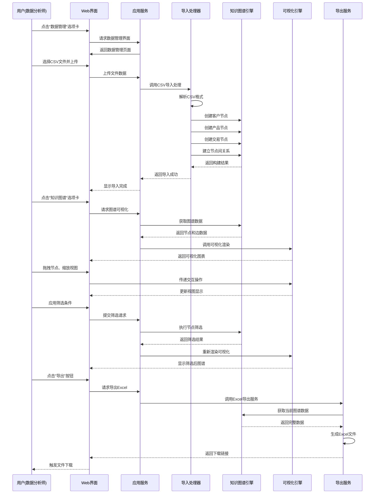
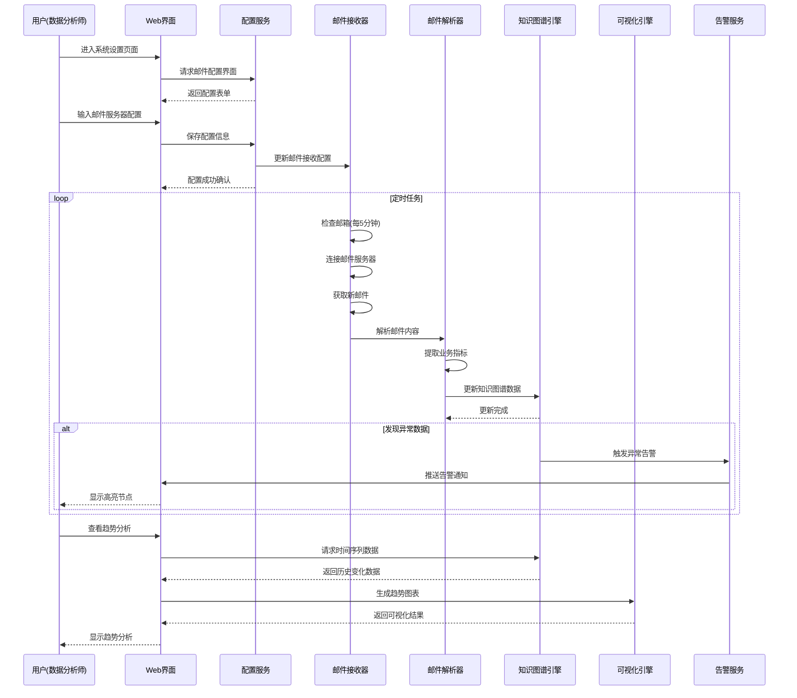
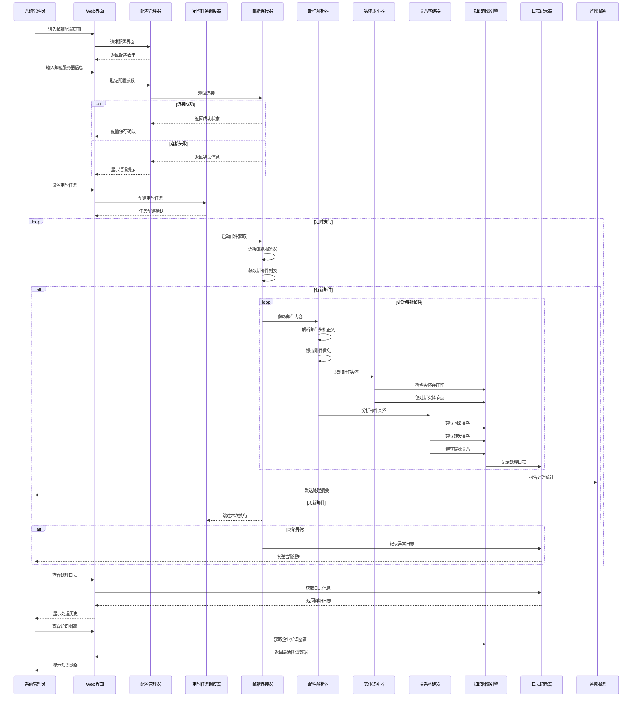
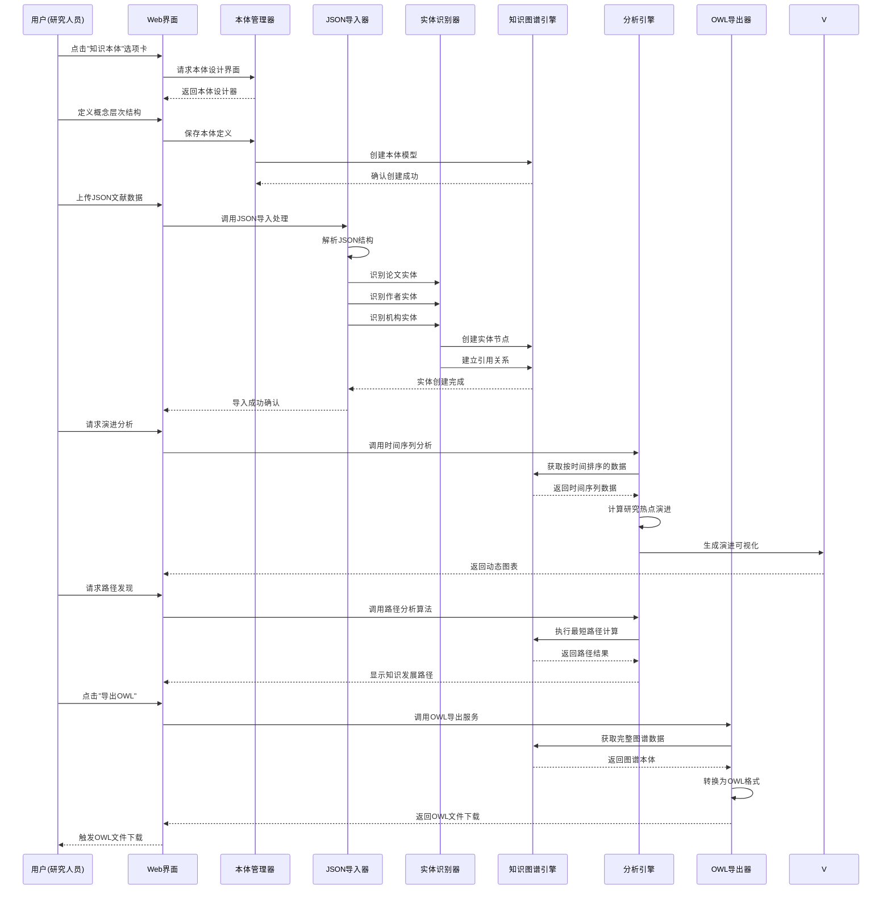
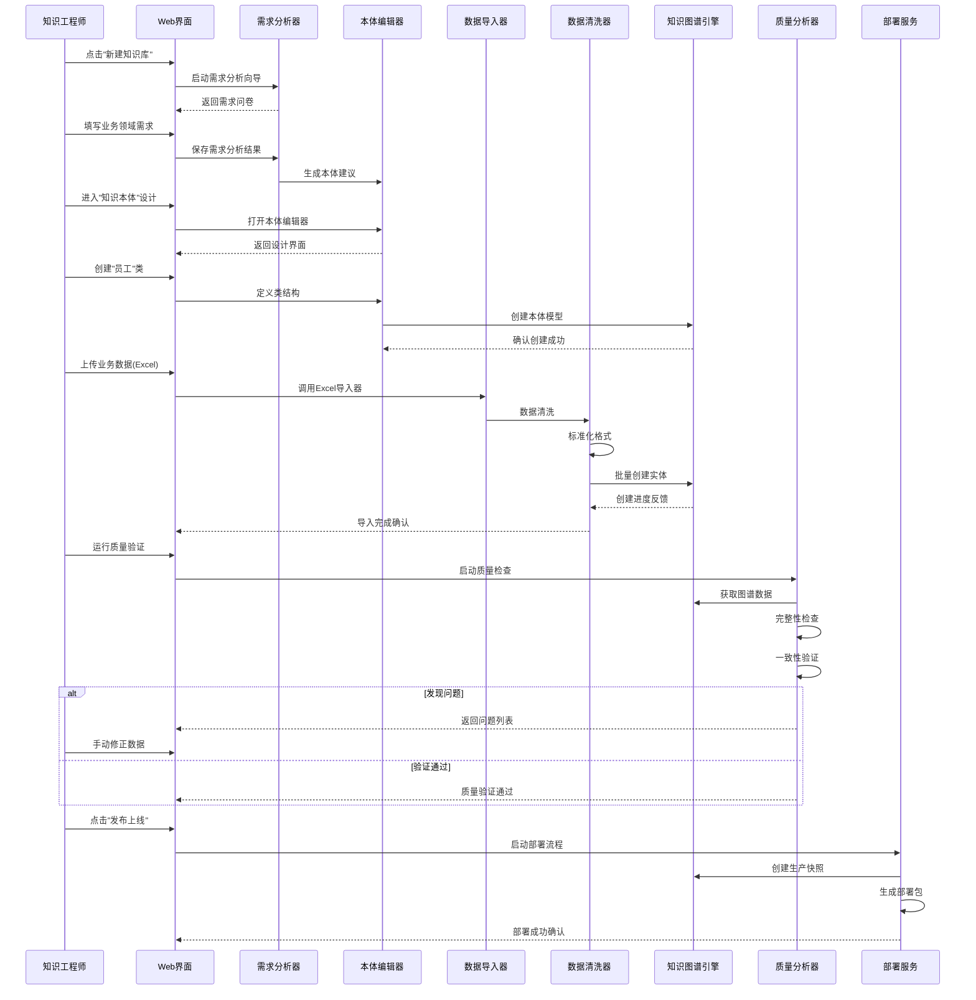
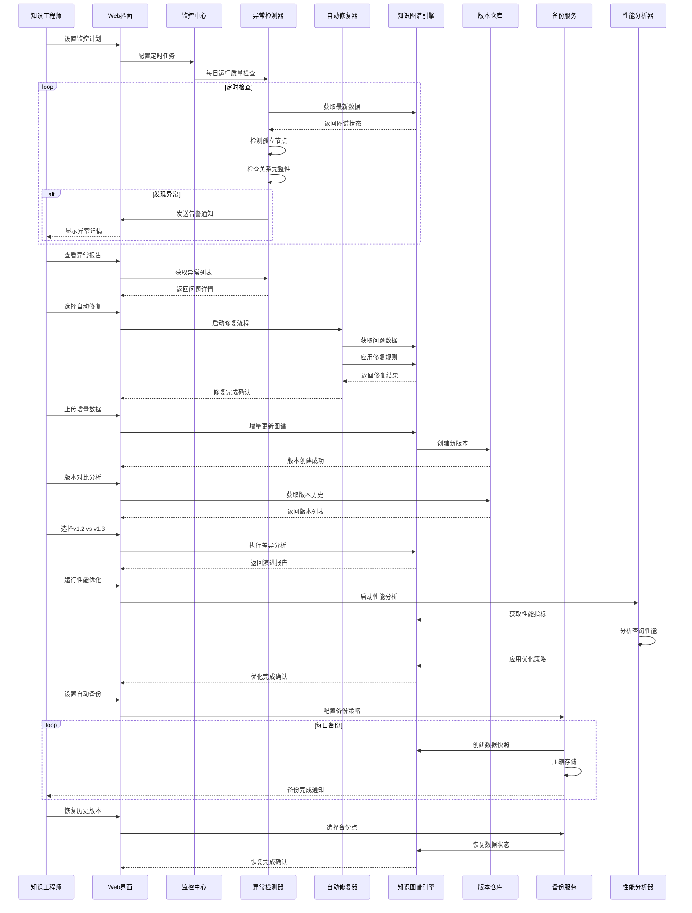
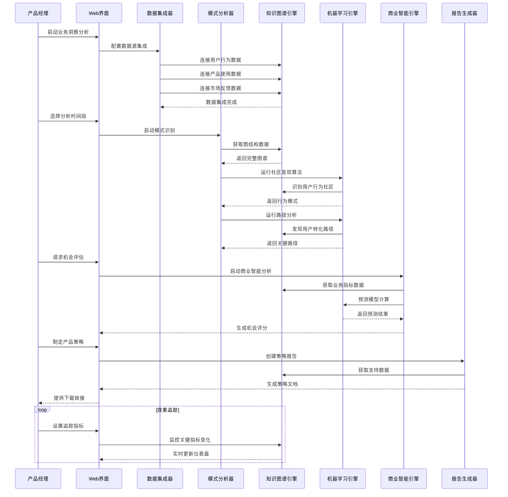
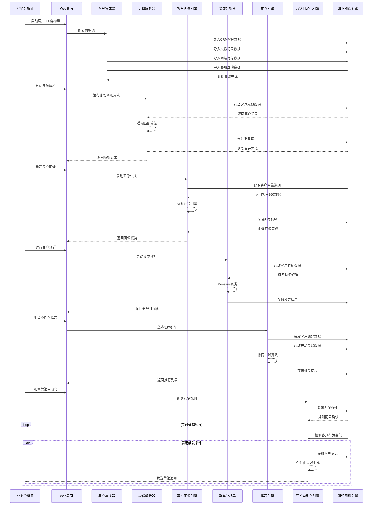

# 知识图谱可视化与管理平台 - 系统设计需求

## 1. 项目概述

### 1.1 项目背景
知识图谱作为一种结构化的知识表示方法，在人工智能、数据分析、知识管理等领域发挥着重要作用。随着企业和研究机构对知识管理需求的不断增长，需要一个直观、易用的知识图谱可视化与管理平台，帮助用户构建、编辑、分析和共享知识图谱。

### 1.2 产品定位
本产品是一个基于Web的知识图谱可视化与管理平台，面向数据分析师、研究人员、知识工程师等专业用户，提供知识图谱的创建、编辑、可视化、分析和导入导出功能。

### 1.3 核心价值
- **可视化展示**：直观展示复杂的知识关系网络
- **交互式编辑**：支持实时的图谱编辑和修改
- **数据互通**：支持多种格式的数据导入导出
- **本体管理**：提供完整的知识本体构建和管理功能
- **易于使用**：友好的用户界面，降低使用门槛

## 2. 用户分析

### 2.1 目标用户

#### 主要用户群体
1. **数据分析师**
   - 需要分析复杂数据关系
   - 构建业务知识图谱
   - 进行数据可视化展示

2. **研究人员**
   - 学术研究中的知识建模
   - 文献关系分析
   - 研究成果可视化

3. **知识工程师**
   - 企业知识库构建
   - 本体设计和管理
   - 知识图谱维护

4. **产品经理/业务分析师**
   - 业务流程梳理
   - 产品关系分析
   - 决策支持可视化

### 2.2 用户需求分析

#### 用户故事

基于当前系统实现，我们定义了以下用户故事，描述不同类型用户如何与系统交互来完成实际工作：

##### 2.2.1 数据分析师用户故事

**用户故事1：构建客户360度视图图谱**
> 作为一名数据分析师，我想要通过导入客户交易数据来构建客户360度视图图谱，以便发现客户行为模式和潜在商机。

**用户旅程：**
1. **数据准备**：登录系统后，进入"数据管理"选项卡
2. **数据导入**：上传包含客户信息、交易记录、产品偏好的CSV文件
3. **自动构建**：系统自动识别数据实体，创建客户、产品、交易等节点
4. **关系建立**：系统自动建立客户-产品、客户-交易等关联关系
5. **可视化展示**：切换到"知识图谱"选项卡查看生成的图谱
6. **模式发现**：通过缩放、筛选等操作发现高价值客户群体
7. **导出报告**：将分析结果导出为Excel报告分享给团队

**系统交互时序图：**


**用户故事2：实时业务监控**
> 作为一名数据分析师，我想要实时接收业务邮件并自动更新知识图谱，以便及时响应市场变化。

**用户旅程：**
1. **配置接收**：在系统设置中配置邮件服务器连接
2. **自动接收**：系统定时检查业务邮箱，接收新的业务报告邮件
3. **内容解析**：系统自动解析邮件内容，提取关键业务指标
4. **图谱更新**：将新的业务数据自动整合到现有知识图谱中
5. **异常提醒**：发现异常数据时在图谱中高亮显示相关节点
6. **趋势分析**：通过时间轴查看业务发展趋势

**系统交互时序图：**


**用户故事3：系统自动企业邮箱邮件获取**
> 作为一名系统管理员，我想要系统自动从企业邮箱获取邮件并构建知识图谱，以便实现企业知识的自动化管理和更新。

**用户旅程：**
1. **邮箱配置**：管理员配置企业邮箱服务器连接参数（IMAP/POP3）
2. **权限验证**：系统验证邮箱访问权限和文件夹权限
3. **定时任务**：设置自动获取频率（每小时/每天/实时）
4. **邮件过滤**：配置邮件过滤规则（发件人、主题、关键词等）
5. **自动解析**：系统自动解析邮件内容、附件和元数据
6. **实体提取**：识别邮件中的关键实体（人员、项目、会议、决策等）
7. **关系构建**：建立邮件间的关系网络（回复链、转发关系、提及关系）
8. **知识整合**：将提取的知识自动整合到企业知识图谱中
9. **增量更新**：仅处理新邮件，避免重复处理
10. **异常处理**：处理网络中断、格式错误等异常情况

**系统交互时序图：**


##### 2.2.2 研究人员用户故事

**用户故事3：学术研究知识图谱构建**
> 作为一名学术研究人员，我想要通过导入文献数据构建研究领域知识图谱，以便发现研究热点和知识演进路径。

**用户旅程：**
1. **文献导入**：上传包含论文标题、作者、关键词、引用关系的JSON数据
2. **本体定义**：在"知识本体"选项卡中定义研究领域概念层次
3. **实体识别**：系统自动识别论文、作者、机构、关键词等实体
4. **关系建模**：建立引用关系、合作关系、主题关联等
5. **演进分析**：通过时间序列分析展示研究热点的演进
6. **路径发现**：发现从早期研究到当前热点的发展路径
7. **成果导出**：导出OWL格式用于其他研究工具

**系统交互时序图：**


**用户故事4：协作研究项目管理**
> 作为一名研究团队负责人，我想要与团队成员协作构建和维护共享的知识图谱，以便统一管理研究资源和发现。

**用户旅程：**
1. **项目创建**：创建新的研究项目知识图谱
2. **权限设置**：为团队成员分配不同的编辑权限
3. **数据共享**：设置共享文件夹，团队成员可以上传研究数据
4. **实时协作**：多人同时编辑图谱，变更实时同步
5. **版本管理**：查看图谱变更历史，必要时回滚到之前版本
6. **成果整合**：整合团队成员的研究成果到主图谱中

**系统交互时序图：**
```mermaid
sequenceDiagram
    participant Lead as 团队负责人
    member as 团队成员
    participant W as Web界面
    participant PM as 项目管理器
    participant Auth as 权限管理器
    participant Sync as 同步服务
    participant Repo as 版本仓库
    participant KG as 知识图谱引擎

    Lead->>W: 创建新项目
    W->>PM: 创建项目空间
    PM->>KG: 初始化空图谱
    PM->>Repo: 创建Git仓库
    PM-->>W: 项目创建成功
    
    Lead->>W: 设置团队成员权限
    W->>Auth: 配置用户权限矩阵
    Auth->>PM: 保存权限配置
    Auth-->>W: 权限设置确认
    
    member->>W: 登录并加入项目
    W->>Auth: 验证用户权限
    Auth-->>W: 返回权限级别
    
    member->>W: 上传研究数据文件
    W->>Sync: 上传到共享文件夹
    Sync->>Repo: 创建新版本分支
    Sync->>KG: 增量更新图谱
    
    alt 多人同时编辑
        member->>W: 编辑节点A
        Lead->>W: 同时编辑节点B
        W->>Sync: 实时同步变更
        Sync->>Sync: 冲突检测与合并
        Sync->>Repo: 记录合并历史
        Sync-->>W: 同步完成通知
    end
    
    Lead->>W: 查看变更历史
    W->>Repo: 获取版本日志
    Repo-->>W: 返回历史记录
    
    Lead->>W: 选择回滚到版本v1.2
    W->>Repo: 执行版本回滚
    Repo->>KG: 恢复历史图谱状态
    Repo-->>W: 回滚完成确认
```

##### 2.2.3 知识工程师用户故事

**用户故事5：企业知识库构建**
> 作为一名知识工程师，我想要从零开始构建企业知识库，将分散的业务知识整合成结构化的知识图谱。

**用户旅程：**
1. **需求分析**：与业务部门沟通，确定知识范围和边界
2. **本体设计**：在"知识本体"选项卡中设计企业知识本体
3. **概念定义**：定义业务实体、关系类型和属性约束
4. **数据收集**：从各个业务系统导出相关数据
5. **数据清洗**：使用系统工具清洗和标准化数据格式
6. **图谱构建**：批量导入数据并自动生成知识图谱
7. **质量验证**：检查图谱完整性，确保符合业务逻辑
8. **发布上线**：将知识图谱部署到生产环境

**系统交互时序图：**


**用户故事6：知识图谱维护和优化**
> 作为一名知识工程师，我想要持续监控和优化知识图谱质量，确保知识的准确性和时效性。

**用户旅程：**
1. **质量监控**：定期运行知识质量检查工具
2. **异常检测**：发现孤立节点、关系缺失等质量问题
3. **人工审核**：对可疑数据进行人工审核和修正
4. **增量更新**：接收新的业务数据，增量更新知识图谱
5. **版本对比**：对比不同版本图谱，分析知识演进趋势
6. **性能优化**：对大规模图谱进行性能调优
7. **备份恢复**：定期备份知识图谱，确保数据安全

**系统交互时序图：**


##### 2.2.4 产品经理/业务分析师用户故事

**用户故事7：业务洞察发现**
> 作为一名产品经理，我想要通过知识图谱发现用户行为模式和产品机会，以便制定更精准的产品策略。

**用户旅程：**
1. **数据集成**：整合用户行为、产品使用、市场反馈等多源数据
2. **模式识别**：使用图算法识别用户行为模式和关联关系
3. **机会发现**：基于模式分析发现潜在的产品机会
4. **影响评估**：评估不同产品决策对业务指标的潜在影响
5. **策略制定**：基于洞察制定产品路线图和优先级
6. **效果追踪**：持续追踪策略实施效果并优化

**系统交互时序图：**


**用户故事8：客户360度视图构建**
> 作为一名业务分析师，我想要构建完整的客户360度视图，整合所有客户相关数据，以便提供个性化服务和精准营销。

**用户旅程：**
1. **数据收集**：收集客户基本信息、交易记录、互动历史等
2. **身份解析**：识别和合并同一客户的多个身份标识
3. **画像构建**：基于行为数据构建客户画像标签
4. **分群分析**：使用聚类算法进行客户分群
5. **个性化推荐**：基于客户画像生成个性化推荐
6. **营销自动化**：设置基于客户行为的自动化营销触发

**系统交互时序图：**


#### 核心需求（已实现）

基于当前系统实现，以下核心需求已经得到满足：

- **直观可视化**：使用Plotly实现的交互式图谱可视化，支持节点拖拽、缩放、筛选等操作
- **便捷操作**：Web界面提供直观的拖拽操作，支持批量节点编辑
- **数据管理**：完整的JSON、CSV、Excel格式数据导入导出功能
- **实时编辑**：支持在线添加、删除、修改节点和边，变更实时生效
- **多格式支持**：兼容主流数据格式，支持OWL/RDF语义网格式导出

#### 扩展需求（规划中）

- **协作功能**：基于Git的多用户协同编辑机制
- **版本管理**：知识图谱版本控制和历史回溯
- **高级分析**：集成图算法库进行中心性分析、社群发现等
- **API接口**：RESTful API支持程序化访问和操作

## 3. 功能需求

### 3.1 核心功能模块

#### 3.1.1 知识图谱可视化
**功能描述**：提供交互式的知识图谱可视化界面

**具体需求**：
- 支持多种布局算法（弹簧布局、圆形布局、层次布局等）
- 节点和边的自定义样式（颜色、大小、形状）
- 缩放、平移、选择等基本交互操作
- 节点和边的详细信息展示
- 搜索和筛选功能
- 图谱统计信息展示

**用户价值**：
- 直观理解复杂的知识关系
- 快速定位关键节点和路径
- 支持大规模图谱的浏览

#### 3.1.2 数据管理
**功能描述**：完整的数据导入导出和管理功能

**具体需求**：
- 支持JSON、CSV、Excel格式的数据导入
- 支持多种格式的数据导出
- 文件上传和下载功能
- 数据格式验证和错误提示
- 批量数据处理
- 数据备份和恢复

**用户价值**：
- 灵活的数据交换能力
- 与现有系统的无缝集成
- 数据安全和可靠性保障

#### 3.1.3 知识本体管理
**功能描述**：提供知识本体的构建、编辑和管理功能

**具体需求**：
- 本体类层次结构管理
- 关系类型定义和管理
- 属性定义和约束设置
- 本体可视化展示
- 本体导出（OWL、RDF格式）
- 本体统计和分析

**用户价值**：
- 规范化的知识表示
- 提高数据质量和一致性
- 支持语义推理和查询

### 3.2 交互功能

#### 3.2.1 图谱编辑
- 节点的添加、删除、修改
- 边的创建、删除、编辑
- 拖拽操作支持
- 批量选择和操作
- 撤销/重做功能

#### 3.2.2 搜索和筛选
- 节点标签搜索
- 节点类型筛选
- 属性值筛选
- 高级查询功能
- 搜索结果高亮显示

#### 3.2.3 视图控制
- 多种布局算法切换
- 缩放级别控制
- 视图重置功能
- 全屏模式支持
- 图例和工具栏

## 4. 非功能性需求

### 4.1 性能需求
- **响应时间**：页面加载时间 < 3秒
- **图谱渲染**：1000个节点的图谱渲染时间 < 5秒
- **数据处理**：支持最大10MB的文件上传
- **并发用户**：支持100个并发用户访问

### 4.2 可用性需求
- **易学性**：新用户15分钟内掌握基本操作
- **易用性**：常用操作不超过3次点击
- **错误处理**：提供清晰的错误信息和解决建议
- **帮助系统**：提供完整的用户手册和在线帮助

### 4.3 兼容性需求
- **浏览器支持**：Chrome 80+、Firefox 75+、Safari 13+、Edge 80+
- **屏幕分辨率**：支持1024x768及以上分辨率
- **移动设备**：基本的移动端浏览支持

### 4.4 安全性需求
- **数据安全**：用户数据本地存储，不上传到服务器
- **输入验证**：所有用户输入进行格式验证
- **错误处理**：避免敏感信息泄露

## 5. 用户界面需求

### 5.1 界面布局
- **响应式设计**：适配不同屏幕尺寸
- **模块化布局**：清晰的功能区域划分
- **选项卡设计**：主要功能通过选项卡组织
- **工具栏**：常用操作快速访问

### 5.2 视觉设计
- **现代化风格**：简洁、专业的视觉风格
- **色彩系统**：一致的色彩规范
- **图标系统**：直观的功能图标
- **字体规范**：清晰易读的字体选择

### 5.3 交互设计
- **直观操作**：符合用户习惯的交互方式
- **即时反馈**：操作结果的及时反馈
- **状态提示**：清晰的系统状态显示
- **快捷键**：提高操作效率的快捷键支持

## 6. 数据需求
1） 数据格式
- **JSON格式**：标准的数据交换格式
- **CSV格式**：表格数据的导入导出
- **Excel格式**：兼容办公软件
- **OWL/RDF格式**：语义网标准格式
- **HDFS格式**：Hadoop分布式文件系统格式
2） 数据质量
- **数据完整性**：必要字段的完整性检查
- **数据一致性**：关联数据的一致性验证
- **数据有效性**：数据格式和范围验证

### 6.1 知识图谱数据需求
- **节点数据**：ID、标签、类型、属性、位置信息
- **边数据**：ID、源节点、目标节点、类型、权重、属性
- **图谱元数据**：创建时间、修改时间、统计信息
- **本体数据**：类定义、关系定义、属性定义

### 6.4 邮件处理数据需求
基于系统自动企业邮箱邮件获取的用户旅程，需要支持以下数据结构：

**邮件元数据结构**：
- 邮件唯一标识（Message-ID、线程ID）
- 发件人信息（邮箱地址、显示名称、所属组织）
- 收件人列表（TO、CC、BCC的完整信息）
- 邮件主题、发送时间、接收时间、优先级
- 邮件标签和分类信息

**邮件内容结构**：
- 纯文本正文和HTML格式正文
- 邮件头完整信息记录
- 内嵌图片引用和外部链接地址
- 邮件与知识图谱节点的关联关系

**邮件处理状态**：
- 接收时间戳、处理开始时间、处理完成时间
- 处理状态（待处理、处理中、成功、失败、部分成功）
- 错误信息和重试次数记录

### 6.5 附件解析数据需求
基于邮件附件文档解析的用户旅程，需要支持以下数据结构：

**附件元数据**：
- 文件基本信息（文件名、文件类型、文件大小、MD5哈希值）
- 原始邮件关联ID和存储路径
- 解析状态和时间戳（解析开始、完成、耗时）

**文档内容解析结果**：
- 文本内容结构化分段（段落、章节、表格、列表）
- 识别到的实体信息（实体文本、实体类型、在文档中的位置、置信度分数）
- 实体间关系（关系类型、源实体、目标实体、关系强度、证据文本片段）

**知识本体映射数据**：
- 实体类型到本体类的映射规则
- 关系类型到本体属性的映射配置
- 属性值的数据类型转换和标准化规则
- 本体约束验证结果和错误报告

### 6.6 配置和权限数据需求（本期不实现）
基于用户配置和权限管理的用户旅程：

**邮箱配置数据**：
- 邮件服务器设置（IMAP/POP3/SMTP服务器地址、端口、协议类型）
- 用户认证信息（用户名、加密存储的密码、OAuth令牌）
- 同步规则配置（文件夹映射、邮件过滤条件、同步频率）
- 邮件处理方式设置（自动处理、手动审核、异常处理策略）

**权限管理数据**：
- 用户角色定义（系统管理员、数据分析师、研究人员、知识工程师等）
- 数据访问权限矩阵（用户对不同项目、不同数据集的访问权限）
- 操作权限控制（读取、写入、删除、导出等操作的权限设置）
- 知识本体访问权限（本体的查看、编辑、发布权限控制）

### 6.7 时序和日志数据需求
基于用户旅程中的处理流程追踪需求：

**处理流程记录**：
- 操作时间戳（用户操作时间、系统处理时间、完成时间）
- 状态变更历史（每个处理步骤的状态变化记录）
- 性能指标（处理耗时、内存使用、错误率统计）

**审计日志**：
- 用户操作日志（登录、数据导入、查询、导出等操作记录）
- 系统事件日志（邮件接收、处理异常、权限变更等事件）
- 数据变更日志（图谱数据的增删改操作记录）

## 7. 系统约束

### 7.1 技术约束
前端：React + TypeScript + AntV G6
       │  WebSocket/HTTP2
       ▼
后端：Spring Boot/Spring Cloud + TinkerPop Gremlin Server
       │  Gremlin Java API
       ▼
图数据库：JanusGraph（兼容TinkerPop）
       ▲
       │ ETL
数据源：CSV/JSON/RDBMS
- **前端技术**：基于React + TypeScript框架
- **可视化库**：使用AntV G6进行图谱渲染
- **数据处理**：使用TinkerPop进行图算法
- **文件格式**：支持主流的数据交换格式

### 7.2 业务约束
- **单机部署**：系统设计为单机应用
- **本地存储**：数据存储在本地文件系统
- **开源协议**：遵循开源软件协议

### 7.3 环境约束
- **操作系统**：支持Windows、macOS、Linux
- **Java版本**：Java 17
- **内存需求**：建议4GB以上内存
- **存储空间**：建议1GB以上可用空间

## 8. 验收标准

### 8.1 功能验收
- 所有核心功能正常工作
- 数据导入导出功能完整
- 图谱可视化效果良好
- 本体管理功能完备

### 8.2 性能验收
- 满足性能需求指标
- 大数据量下系统稳定
- 内存使用合理
- 响应时间符合要求

### 8.3 用户体验验收
- 界面友好易用
- 操作流程顺畅
- 错误处理得当
- 帮助文档完整

## 9. 项目里程碑

### 9.1 第一阶段：核心功能开发
- 基础图谱可视化
- 数据导入导出
- 基本交互功能

### 9.2 第二阶段：功能完善
- 本体管理功能
- 高级搜索筛选
- 界面优化

### 9.3 第三阶段：测试和发布
- 全面功能测试
- 性能优化
- 文档完善
- 正式发布

## 10. 风险分析

### 10.1 技术风险
- **性能风险**：大规模图谱的渲染性能
- **兼容性风险**：不同浏览器的兼容性问题
- **数据风险**：大文件处理的稳定性

### 10.2 用户风险
- **学习成本**：用户学习使用的时间成本
- **数据迁移**：现有数据的迁移难度
- **功能期望**：用户期望与实际功能的差距

### 10.3 项目风险
- **进度风险**：开发进度延期的可能性
- **质量风险**：软件质量不达标的风险
- **资源风险**：开发资源不足的风险

---

**文档版本**：1.0  
**编写日期**：2024年12月  
**编写人员**：产品团队  
**审核状态**：待审核