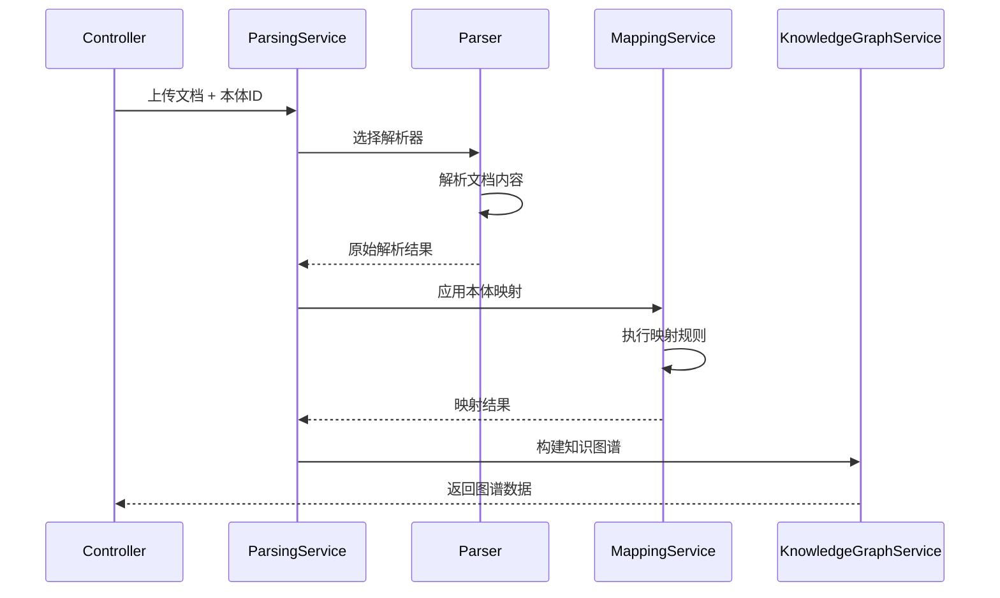
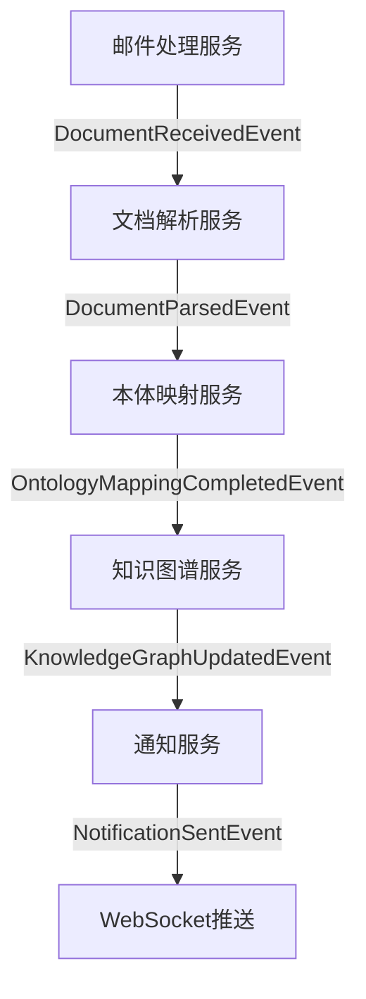

## 新增需求
系统接收到邮件后，解析邮件附件，通过指定的知识本体解析附件文档中节点、边和属性。

## 🔍 分析结果
结论：当前用户旅程中缺少"通过指定知识本体解析附件文档"的完整场景 。

### 📊 现状分析：
| 功能模块 | 现有覆盖 | 缺失情况 |
| -------- | -------- | -------- |
| 系统接收邮件 | ✅ 已覆盖 | - |
| 解析附件 | ✅ 基础解析（提取附件信息） | ❌ 深度内容解析 |
| 知识本体应用 | ❌ 未体现 | 缺少指定本体结构解析 |
| 节点/边/属性提取 | ❌ 不完整 | 缺少基于本体的结构化提取 |

### 🎯 具体缺失：
1. 1. 附件文档内容解析 ：现有用户故事3只提到"提取附件信息"，但未涉及文档内容的深度解析
2. 2. 知识本体指导解析 ：缺少"根据预定义知识本体结构来解析附件文档"的过程
3. 3. 结构化提取 ：缺少基于本体定义的规则来提取节点、边和属性
### 💡 需要补充的场景：
- 系统接收带附件的邮件后，识别附件类型（PDF、Word、Excel等）
- 根据指定的知识本体结构解析文档内容
- 按本体定义的实体类型提取节点
- 按本体定义的关系类型建立边
- 按本体定义的属性规范提取属性值
当前用户旅程主要关注邮件本身的元数据解析，而非附件文档的内容结构化解析。

---

## 📋 实施规划方案

基于现有架构设计，针对"通过指定知识本体解析附件文档"的新增需求，提供两种架构的实施规划：

### 🏗️ MVC单体架构实施方案

#### 1. 架构扩展设计
基于《系统概要设计_Java_MVC单体版.md》的现有架构，新增**附件文档解析模块**：

```
┌─────────────────────────────────────────────────────────────────┐
│                    新增：附件文档解析层                            │
│  ┌─────────────────────┐  ┌─────────────────────┐              │
│  │  文档解析服务层     │  │  本体映射服务层      │              │
│  │  - PDF解析器       │  │  - 本体规则引擎      │              │
│  │  - Word解析器      │  │  - 实体映射器        │              │
│  │  - Excel解析器     │  │  - 关系构建器        │              │
│  └─────────────────────┘  └─────────────────────┘              │
└─────────────────────────────────────────────────────────────────┘
```

#### 2. 核心组件设计

##### 2.1 新增数据模型
```java
// 文档解析结果模型
public class DocumentParseResult {
    private String documentId;
    private String fileName;
    private String fileType;  // PDF/DOCX/XLSX
    private List<ExtractedEntity> entities;
    private List<ExtractedRelation> relations;
    private Map<String, Object> metadata;
    private OntologyMappingResult ontologyMapping;
    private LocalDateTime parsedAt;
}

// 本体映射配置模型
public class OntologyMappingConfig {
    private String ontologyId;
    private Map<String, String> entityTypeMapping;  // 文档实体类型 -> 本体类
    private Map<String, String> relationTypeMapping;  // 文档关系 -> 本体属性
    private List<PropertyMappingRule> propertyRules;
}
```

##### 2.2 服务层扩展
```java
// 文档解析服务
@Service
public class DocumentParsingService {
    @Autowired
    private List<DocumentParser> parsers;  // 策略模式
    
    @Autowired
    private OntologyMappingService mappingService;
    
    public DocumentParseResult parseDocument(MultipartFile file, String ontologyId) {
        DocumentParser parser = selectParser(file.getContentType());
        ParseResult rawResult = parser.parse(file);
        return mappingService.mapToOntology(rawResult, ontologyId);
    }
}

// 本体映射服务
@Service
public class OntologyMappingService {
    public KnowledgeGraph buildKnowledgeGraph(DocumentParseResult result) {
        // 基于本体规则构建知识图谱
        return knowledgeGraphBuilder.build(result);
    }
}
```

##### 2.3 控制器扩展
```java
@RestController
@RequestMapping("/api/documents")
public class DocumentController {
    
    @PostMapping("/parse")
    public ResponseEntity<ParseResponse> parseDocument(
            @RequestParam("file") MultipartFile file,
            @RequestParam("ontologyId") String ontologyId) {
        
        DocumentParseResult result = parsingService.parseDocument(file, ontologyId);
        KnowledgeGraph graph = mappingService.buildKnowledgeGraph(result);
        
        return ResponseEntity.ok(new ParseResponse(graph, result));
    }
}
```

#### 3. 技术实现细节

##### 3.1 文档解析器实现
```java
@Component
public class PDFDocumentParser implements DocumentParser {
    
    @Override
    public ParseResult parse(InputStream inputStream) {
        // 使用Apache PDFBox解析PDF
        PDDocument document = PDDocument.load(inputStream);
        
        // 提取文本和结构
        PDFTextStripper stripper = new PDFTextStripper();
        String text = stripper.getText(document);
        
        // 实体识别和关系提取
        return extractEntitiesAndRelations(text);
    }
}

@Component
public class WordDocumentParser implements DocumentParser {
    
    @Override
    public ParseResult parse(InputStream inputStream) {
        // 使用Apache POI解析Word文档
        XWPFDocument doc = new XWPFDocument(inputStream);
        return parseWordContent(doc);
    }
}
```

##### 3.2 本体规则引擎
```java
@Component
public class OntologyRuleEngine {
    
    public List<KnowledgeTriple> applyRules(
            List<ExtractedEntity> entities, 
            OntologyMappingConfig config) {
        
        return entities.stream()
            .map(entity -> applyEntityRules(entity, config))
            .filter(Objects::nonNull)
            .collect(Collectors.toList());
    }
    
    private KnowledgeTriple applyEntityRules(
            ExtractedEntity entity, 
            OntologyMappingConfig config) {
        // 根据本体规则创建知识三元组
        String subject = entity.getId();
        String predicate = config.getRelationTypeMapping(entity.getType());
        String object = entity.getNormalizedValue();
        
        return new KnowledgeTriple(subject, predicate, object);
    }
}
```

#### 4. 数据流设计


#### 5. 部署配置
```yaml
# application.yml 新增配置
spring:
  servlet:
    multipart:
      max-file-size: 10MB
      max-request-size: 10MB

document:
  parsing:
    max-concurrent: 5
    timeout: 300s
    supported-formats: ["pdf", "docx", "xlsx", "txt"]
    
  ontology:
    mapping:
      cache-enabled: true
      cache-ttl: 3600s
```

---

### 🏗️ DDD微服务架构实施方案

#### 1. 领域建模与微服务拆分

##### 1.1 新增业务域识别
基于《系统概要设计_Java_DDD微服务版.md》，新增**文档解析域**作为独立微服务：

```
新增微服务：document-parser-service
├── domain/                    # 文档解析领域
│   ├── model/
│   │   ├── Document.java       # 文档聚合根
│   │   ├── ParseJob.java       # 解析作业实体
│   │   ├── ExtractedEntity.java # 提取实体值对象
│   │   └── ParseResult.java    # 解析结果值对象
│   ├── service/
│   │   ├── DocumentParsingService.java
│   │   └── OntologyMappingService.java
│   └── repository/
│       └── DocumentRepository.java

新增微服务：ontology-mapping-service
├── domain/                     # 本体映射领域
│   ├── model/
│   │   ├── MappingRule.java   # 映射规则聚合根
│   │   ├── OntologyClass.java # 本体类值对象
│   │   └── MappingResult.java # 映射结果值对象
│   ├── service/
│   │   └── OntologyMappingEngine.java
│   └── repository/
│       └── MappingRuleRepository.java
```

#### 2. 领域事件设计

##### 2.1 核心领域事件
```java
// 文档解析完成事件
public class DocumentParsedEvent {
    private final String documentId;
    private final String parseJobId;
    private final ParseResult result;
    private final String ontologyId;
    private final Instant occurredOn;
}

// 本体映射完成事件
public class OntologyMappingCompletedEvent {
    private final String mappingId;
    private final String documentId;
    private final KnowledgeGraphFragment graphFragment;
    private final List<MappingConflict> conflicts;
}

// 知识图谱更新事件
public class KnowledgeGraphUpdatedEvent {
    private final String graphId;
    private final KnowledgeGraphFragment fragment;
    private final String sourceDocumentId;
    private final UpdateType updateType;
}
```

#### 3. 微服务间通信设计

##### 3.1 事件驱动架构


##### 3.2 微服务API设计

###### 3.2.1 文档解析服务API
```java
// REST API
@RestController
@RequestMapping("/api/v1/documents")
public class DocumentParseController {
    
    @PostMapping("/parse-async")
    public ResponseEntity<ParseJobResponse> submitParseJob(
            @RequestBody SubmitParseRequest request) {
        
        ParseJob job = parseApplicationService.submitParseJob(
            request.getDocumentId(), 
            request.getOntologyId()
        );
        
        return ResponseEntity.accepted()
            .body(new ParseJobResponse(job.getId(), job.getStatus()));
    }
    
    @GetMapping("/jobs/{jobId}/status")
    public ResponseEntity<JobStatusResponse> getJobStatus(@PathVariable String jobId) {
        return ResponseEntity.ok(queryService.getJobStatus(jobId));
    }
}

// 事件监听器
@Component
public class EmailReceivedEventHandler {
    
    @EventHandler
    public void handle(EmailReceivedEvent event) {
        List<String> attachmentIds = event.getAttachmentIds();
        
        attachmentIds.forEach(attachmentId -> {
            ParseJob job = parseApplicationService.createParseJob(
                attachmentId,
                event.getConfiguredOntologyId()
            );
            
            eventPublisher.publishEvent(
                new ParseJobCreatedEvent(job.getId(), attachmentId)
            );
        });
    }
}
```

###### 3.2.2 本体映射服务API
```java
@Service
public class OntologyMappingApplicationService {
    
    public void handleDocumentParsed(DocumentParsedEvent event) {
        MappingContext context = createMappingContext(
            event.getOntologyId(), 
            event.getResult()
        );
        
        MappingResult result = mappingEngine.applyMapping(context);
        
        eventPublisher.publishEvent(
            new OntologyMappingCompletedEvent(
                result.getMappingId(),
                event.getDocumentId(),
                result.getGraphFragment(),
                result.getConflicts()
            )
        );
    }
    
    private MappingContext createMappingContext(String ontologyId, ParseResult parseResult) {
        Ontology ontology = ontologyRepository.findById(ontologyId);
        return new MappingContext(ontology, parseResult);
    }
}
```

#### 4. 数据一致性保证

##### 4.1 Saga事务管理
```java
@Configuration
public class DocumentParsingSaga {
    
    @Saga
    @StartSaga
    @SagaEventHandler(associationProperty = "documentId")
    public void handle(DocumentReceivedEvent event) {
        SagaLifecycle.associateWith("parseJobId", event.getParseJobId());
        
        // 步骤1：提交解析作业
        commandGateway.send(new SubmitParseCommand(event.getDocumentId()));
    }
    
    @SagaEventHandler(associationProperty = "parseJobId")
    public void handle(ParseJobCompletedEvent event) {
        // 步骤2：提交映射作业
        commandGateway.send(new SubmitMappingCommand(
            event.getDocumentId(),
            event.getParseResult()
        ));
    }
    
    @SagaEventHandler(associationProperty = "mappingId")
    public void handle(MappingCompletedEvent event) {
        // 步骤3：更新知识图谱
        commandGateway.send(new UpdateKnowledgeGraphCommand(
            event.getGraphFragment()
        ));
        
        SagaLifecycle.end();
    }
    
    @SagaEventHandler(associationProperty = "documentId")
    public void handle(ParseJobFailedEvent event) {
        // 补偿事务：记录失败，通知用户
        commandGateway.send(new NotifyFailureCommand(event.getDocumentId()));
        SagaLifecycle.end();
    }
}
```

#### 5. 技术栈扩展

##### 5.1 新增微服务技术栈
```yaml
# document-parser-service 配置
spring:
  application:
    name: document-parser-service
  
  cloud:
    stream:
      bindings:
        document-received-in:
          destination: document-events
          group: document-parser
        parse-completed-out:
          destination: parse-events

# 文档解析配置
parser:
  pdf:
    engine: apache-pdfbox
    ocr-enabled: true
  word:
    engine: apache-poi
  excel:
    engine: apache-poi
  
  max-file-size: 50MB
  concurrent-jobs: 10
  retry-policy:
    max-attempts: 3
    backoff-delay: 5000ms

# 本体映射服务配置
ontology:
  mapping:
    cache:
      type: redis
      ttl: 3600s
    rule-engine:
      type: drools
      hot-reload: true
```

##### 5.2 容器化配置
```dockerfile
# document-parser-service Dockerfile
FROM openjdk:17-jre-slim

WORKDIR /app

COPY target/document-parser-service.jar app.jar

# 安装文档解析依赖
RUN apt-get update && apt-get install -y \
    tesseract-ocr \
    libtesseract-dev \
    && rm -rf /var/lib/apt/lists/*

EXPOSE 8083

ENTRYPOINT ["java", "-jar", "app.jar"]
```

#### 6. 监控与运维

##### 6.1 微服务监控指标
```java
@Component
public class DocumentParsingMetrics {
    
    private final MeterRegistry registry;
    
    public void recordParseJob(String fileType, boolean success, long duration) {
        registry.counter("document.parse.jobs", 
            "type", fileType,
            "status", success ? "success" : "failure"
        ).increment();
        
        registry.timer("document.parse.duration", "type", fileType)
            .record(duration, TimeUnit.MILLISECONDS);
    }
    
    public void recordMappingJob(String ontologyId, int entityCount) {
        registry.gauge("document.mapping.entities", 
            List.of(Tag.of("ontology", ontologyId)),
            entityCount
        );
    }
}
```

##### 6.2 健康检查端点
```java
@Component
public class DocumentParserHealthIndicator implements HealthIndicator {
    
    @Override
    public Health health() {
        Health.Builder builder = new Health.Builder();
        
        try {
            // 检查解析引擎状态
            boolean pdfParserHealthy = checkPdfParser();
            boolean wordParserHealthy = checkWordParser();
            
            if (pdfParserHealthy && wordParserHealthy) {
                builder.up()
                    .withDetail("pdf-parser", "healthy")
                    .withDetail("word-parser", "healthy");
            } else {
                builder.down()
                    .withDetail("pdf-parser", pdfParserHealthy)
                    .withDetail("word-parser", wordParserHealthy);
            }
        } catch (Exception e) {
            builder.down().withException(e);
        }
        
        return builder.build();
    }
}
```

---
### 📋 完成内容总结
#### ✅ MVC单体架构实施方案
- 架构扩展 ：在现有MVC架构基础上新增文档解析层和本体映射层
- 核心组件 ：包含完整的Java代码示例，涵盖数据模型、服务层、控制器
- 技术实现 ：提供了PDF、Word、Excel等文档解析器的具体实现方案
- 部署配置 ：包含Spring Boot配置和性能参数设置
#### ✅ DDD微服务架构实施方案
- 领域建模 ：新增document-parser-service和ontology-mapping-service两个微服务
- 事件驱动 ：设计了完整的领域事件和微服务间通信机制
- Saga事务 ：提供分布式事务管理的具体实现
- 运维监控 ：包含健康检查、性能指标、容器化配置

### 📊 两种架构对比总结

| 维度 | MVC单体架构 | DDD微服务架构 |
|------|-------------|---------------|
| **开发复杂度** | 低，单一代码库 | 高，多服务协调 |
| **部署复杂度** | 低，单一容器 | 高，需要K8s编排 |
| **扩展性** | 垂直扩展为主 | 水平扩展，弹性伸缩 |
| **数据一致性** | 本地事务 | Saga分布式事务 |
| **技术栈** | Spring Boot + 单DB | Spring Cloud + 多DB |
| **运维成本** | 低 | 高，需要监控体系 |
| **适用场景** | 中小规模，快速迭代 | 大规模，高并发 |
| **实施周期** | 2-3周 | 4-6周 |
| **需求变更响应** | ⚡ 快速，单点修改 | 🔄 复杂，需协调多服务 |
| **系统设计方便** | 🎯 简单，统一设计 | 📐 复杂，需领域建模 |
| **测试复杂度** | 🧪 单元测试简单 | 🔬 集成测试复杂 |
| **团队协作** | 👥 小团队高效 | 🏢 大团队分工明确 |
| **技术债务** | 📈 随时间累积 | 🔄 可逐步重构 |
| **故障隔离** | ❌ 单点故障影响大 | ✅ 服务隔离，影响小 |
| **性能调优** | 🎯 集中优化 | 🔍 需逐个服务优化 |
| **文档维护** | 📚 单一文档 | 📖 多服务文档同步 |
| **上线回滚** | ⚡ 简单快速 | 🔄 复杂，需协调回滚 |
| **开发工具** | 🛠️ 标准IDE即可 | 🏗️ 需微服务工具链 |
| **需求追踪** | 🔍 代码内追踪 | 📊 跨服务追踪 |
| **重构成本** | 💰 高，影响面广 | 💡 低，可逐步重构 |

#### 🔍 需求变更响应详细对比

| 变更类型 | MVC单体架构 | DDD微服务架构 |
|----------|-------------|---------------|
| **新增文档格式支持** | 📁 单模块修改，1-2天 | 🏗️ 需更新文档解析服务，2-3天 |
| **本体规则调整** | ⚙️ 集中修改规则引擎，半天 | 🔧 更新本体映射服务，需测试接口，1天 |
| **性能优化需求** | 🎯 整体优化，影响所有功能 | 🚀 针对性优化单个服务，风险小 |
| **新业务流程** | 📋 需理解整个系统，开发慢 | 🎯 新增微服务，独立开发快 |
| **第三方集成** | 🔗 集中集成，耦合度高 | 🔌 独立服务集成，松耦合 |

#### 🎨 系统设计便利性对比

| 设计维度 | MVC单体架构 | DDD微服务架构 |
|----------|-------------|---------------|
| **数据库设计** | 🗄️ 单一数据库，表关联复杂 | 🏗️ 服务数据库，边界清晰 |
| **接口设计** | 📝 内部接口，修改灵活 | 🌐 API契约，需版本管理 |
| **缓存策略** | 💾 集中缓存，一致性好 | 🔄 分布式缓存，策略复杂 |
| **安全设计** | 🔒 统一认证，实现简单 | 🛡️ 服务间认证，需JWT/OAuth |
| **监控设计** | 📊 集中监控，配置简单 | 🔍 分布式追踪，需链路监控 |
| **日志设计** | 📝 单一日志，查询方便 | 📊 日志聚合，需ELK栈 |
| **配置管理** | ⚙️ 单一配置文件 | 🔧 分布式配置中心 |
| **部署策略** | 🚀 一键部署 | 🎯 蓝绿部署，金丝雀发布 |

### 🎯 实际落地建议

#### 📋 决策矩阵

| 企业现状 | 推荐架构 | 实施策略 |
|----------|----------|----------|
| **初创公司/小团队** | MVC单体 | 快速验证，后期演进 |
| **中型企业/成熟团队** | DDD微服务 | 领域驱动，分步实施 |
| **大型企业/复杂业务** | DDD微服务 | 全面微服务化 |
| **技术债务严重** | MVC重构 | 先单体重构，再拆分 |

#### 🚀 演进路径建议

1. **MVC起步策略** (0-6个月)
   - 快速实现核心功能
   - 建立监控体系
   - 积累业务知识

2. **模块化准备** (6-12个月)
   - 代码模块化
   - 接口抽象
   - 数据访问层隔离

3. **服务拆分** (12-18个月)
   - 识别拆分边界
   - 逐步服务化
   - 建立基础设施

4. **微服务成熟** (18个月+)
   - 完善治理体系
   - 性能优化
   - 自动化运维